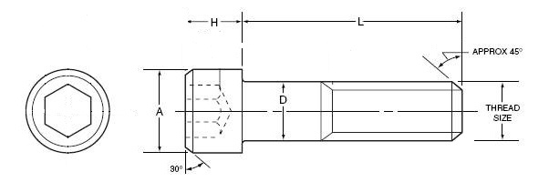
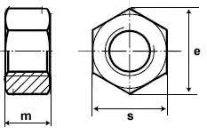

## Dimensions for Self Tapping Screws

- **M3:** 2.5mm (tight) or 2.75mm hole
    - using M3x12mm on a 2mm thick surface
    - repeated removal loosens them up ... so 2.5mm might be best over time

## 3d Printer Dimensions for Fasteners [mm]




| Type | Screw Dia. (D) | Print Dia. | Socket Cap Dia. (A)  | Socket Cap Depth (H) | Nut Width (E) | Nut Depth (M) |
|------|----------------|------------|----------------------|----------------------|---------------|---------------|
| M2   | 2              | 2.2        | 4                    | 2                    | 4.65          | 1.7 |
| M3   | 3              | 3.3        | 6                    | 3                    | 6.4           | 2.5 |
| M4   | 4              | 4.3        | 7.5                  | 4                    | 8.1           | 3.3 |
| M5   | 5              | 5.3        | 9                    | 5                    | 9.3           | 4.8 |

- [Ita Fasteners](https://itafasteners.com/products-socket-head-cap-screws.php)

## OpenScad Code for Fasteners

```openscad
// https://www.engineersedge.com/hardware/standard_metric_hex_nuts_13728.htm
// m2: d=4    D=4.62
// m3: d=5.5  D=6.35
module hex(D,t){
    // D is outter diameter
    x = D/2;
    y = sqrt(3)/2*x;
    pts = [
        [x/2,y],
        [x,0],
        [x/2,-y],
        [-x/2,-y],
        [-x,0],
        [-x/2,y]
    ];
    linear_extrude(height=t){
        polygon(pts);
    }
}

module M3Nut(t){
    hex(6.4, t);
}

module M2Nut(t){
    hex(4.65, t);
}

module M2(t){
    cylinder(3*t, d=2.2, center=true);
    translate([0,0,-1]) M2Nut(3); // nut
}

module M3(t){
    cylinder(h=3*t, d=3.3, center=true);
    translate([0,0,2]) cylinder(h=3*t, d=7, center=false); // head
}
```

## Imperial Standard to Metric Conversion

| Guage               | Decimal             | Metric              |
|---------------------|---------------------|---------------------|
| 0                   | 0.060\"             | 1.524 mm            |
| 1                   | 0.073\"             | 1.854 mm            |
| 2                   | 0.086\"             | 2.180 mm            |
| 3                   | 0.099\"             | 2.515 mm            |
| 4                   | 0.112\"             | 2.845 mm            |
| 5                   | 0.125\"             | 3.175 mm            |
| 6                   | 0.138\"             | 3.505 mm            |
| 8                   | 0.164\"             | 4.166 mm            |

## References

- [metric socket cap screws](https://www.engineersedge.com/hardware/_metric_socket_head_cap_screws_14054.htm)
- [metric nuts](https://www.engineersedge.com/hardware/standard_metric_hex_nuts_13728.htm)
