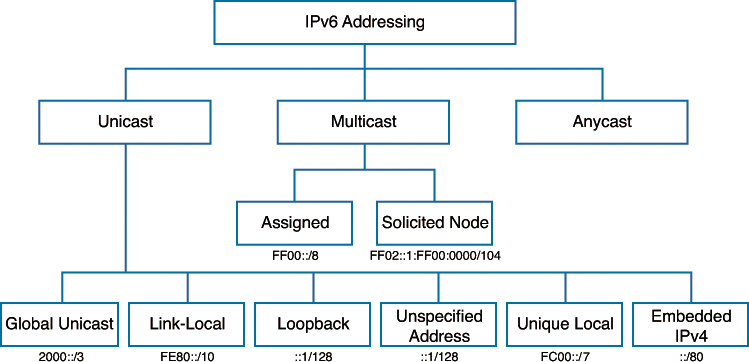

# IPv6

Here are some useful notes:

- IPv6 addresses are 128b hex numbers
- Link local unicast addresses start with `fe80::` (IPv4: `169.254.0.0/16`)
- Multicast addresses begin with `ff0x` where x is a number from 1-8 or `ff00::/8`
- Leading zeros are suppressed
- Inline zero can sometimes be suppressed
    - `FE80:CD00:0000:0000:0000:0000:211E:729C` becomes `FE80:CD00::211E:729C`
- Loopback address (IPv4: `127.0.0.1`) looks like: `::1`
- DNS records for IPv6 are AAAA
- Global addresses can be routed across the interweb
- Unique local address is like a private IPv4 address that is not routable across the interweb. They are `fc00::/7`
