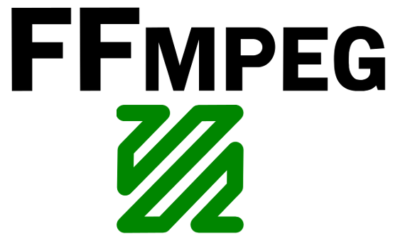

FFMPEG
=======

:date: 2015-01-23
:summary: Using ``ffmpeg`` to convert video formats

Converting flv to mp4
------------------------

::

	ffmpeg -i input.flv -c:v libx264 -crf 19 output.mp4
	ffmpeg -i input.flv -c:v libx264 -crf 23 -c:a libfaac -q:a 100 output.mp4

Use `libx264 <https://trac.ffmpeg.org/wiki/Encode/H.264>`__ with -c:v (codec video) to
encode. To improve the video quality, you can use a lower CRF value, e.g. anything down
to 18. To get a smaller file, use a higher CRF, but note that this will degrade quality.
Anything between 18 and 28 is reasonable with 23 being default.

To improve the audio quality, use a higher quality value (-q:a). For FAAC, 100 is default.

Convert AVI/MOV to MP4
-------------------------

::

	ffmpeg -i input.avi output.mp4

By default it grabs one video stream and audio stream, but you can change this. If
your movie has (note, this is not actual output from ``ffmpeg -i move.mov`` just an example):

* stream 0:0 h264 video
* stream 0:1 aac (ger)
* stream 0:2 aac (en)

I just want to grab the video and the english audio, I can do:

::

	ffmpeg -i input.avi -map 0:0 -map 0:2 output.avi
