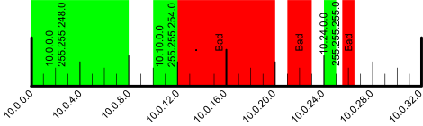
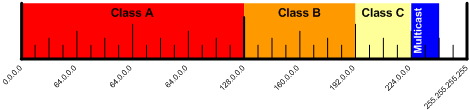
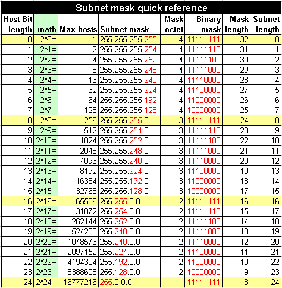

Subnetting
===========

:date: 2015-12-28
:summary: How IPv4 subnetting works

`IP subnetting made
easy <http://www.techrepublic.com/blog/data-center/ip-subnetting-made-easy-125343/>`__
by George Ou has a good overview, here is a summary.

The IP address is a 32 bit number which provides 0 to 4,294,967,295
unique addresses on a network. This is chopped up into 4 8-bit octets
separated by a period.

0.0.0.0 to 0.0.0.255 is one octet which provide 256 addresses.

Subnetwork
----------

Chopping a large network up into smaller pieces is subnetworking.

-  beginning is always even, network id
-  ending is always odd, broadcast id
-  you can not use the network or broadcast id address, since they have
   special meaning
-  0.0.0.0/8 (0.0.0.0 to 0.255.255.255) not used
-  127.0.0.0/8 (127.0.0.0 to 127.255.255.255) used for loop back
   addresses
-  Number of hosts: 2^bits - 2 where bits is the number of bits for the
   subnet and the -2 accounts for both the network and broadcast id's

You need to chop along clean binary division as shown below:

`Network Classes <http://en.wikipedia.org/wiki/Classful_network#Introduction_of_address_classes>`__
---------------------------------------------------------------------------------------------------

+---------+--------------------------------+---------------+-------------+--------------------------------------------------+
| Class   | IP Range                       | Subnet Bits   | Mask Bits   | Notes                                            |
+=========+================================+===============+=============+==================================================+
| A       | 0.0.0.0 to 127.255.255.255     | 24            | 8           | the first half of the address space              |
+---------+--------------------------------+---------------+-------------+--------------------------------------------------+
| B       | 128.0.0.0 to 191.255.255.255   | 16            | 16          | half the remaining address space                 |
+---------+--------------------------------+---------------+-------------+--------------------------------------------------+
| C       | 192.0.0.0 to 223.255.255.255   | 8             | 24          | half the remaining address space                 |
+---------+--------------------------------+---------------+-------------+--------------------------------------------------+
| D       | 224.0.0.0 to 239.255.255.255   | undefined     | undefined   | half the remaining address space for multicast   |
+---------+--------------------------------+---------------+-------------+--------------------------------------------------+
| E       | 240.0.0.0 to 255.255.255.255   | undefined     | undefined   | everything remaining                             |
+---------+--------------------------------+---------------+-------------+--------------------------------------------------+

`Private Subnetworks <http://en.wikipedia.org/wiki/Private_network>`__
----------------------------------------------------------------------

+---------+---------------+-------------+------------------+----------------------------------+-------------------+
| Class   | Subnet Bits   | Mask Bits   | IP               | IP Range                         | Number of Hosts   |
+=========+===============+=============+==================+==================================+===================+
| A       | 24            | 8           | 10.0.0.0/8       | 10.0.0.0 to 10.255.255.255       | 16,777,216        |
+---------+---------------+-------------+------------------+----------------------------------+-------------------+
| B       | 20            | 12          | 172.16.0.0/12    | 172.16.0.0 to 172.31.255.255     | 1,048,576         |
+---------+---------------+-------------+------------------+----------------------------------+-------------------+
| C       | 16            | 16          | 192.168.0.0/16   | 192.168.0.0 to 192.168.255.255   | 65,536            |
+---------+---------------+-------------+------------------+----------------------------------+-------------------+
| C       | 16            | 16          | 169.254.0.0/16   | 169.254.0.0 to 169.254.255.255   | 65,536            |
+---------+---------------+-------------+------------------+----------------------------------+-------------------+

The 169.254.0.0 addresses are only used when DHCP server is not
available.

Address Bits
------------

-  8 bits = 256 addresses (254 hosts, minus the network and broadcast
   id's)
-  9 bits = 512 addresses
-  10 bits = 1024 addresses
-  11 bits = 2048 addresses

.. figure:: pics/subnetting_a.png
   :alt:

Masks
-----

Typical home networks use 192.168.0.0/16 where the 16 indicates a 16-bit
mask giving addresses from 192.168.0.0 to 192.168.255.255. Since a
complete mask is 32-bits and each octet is 8-bits each, 16-bits uses the
bottom 2 octets or 192.168.x.x. An 8-bit mask would use the lower 3
octets or 192.x.x.x. A 24-bit mask would only use the bottom octet of
the address range, or 192.168.1.x.

-  8-bit mask: 255.0.0.0
-  16-bit mask: 255.255.0.0
-  24-bit mask: 255.255.255.0

Calculator
----------

`IP address calculator <http://www.subnet-calculator.com>`__ `Another
one <http://jodies.de/ipcalc?>`__

::

    192.168.0.1/16:
    Address:   192.168.0.1           11000000.10101000 .00000000.00000001
    Netmask:   255.255.0.0 = 16      11111111.11111111 .00000000.00000000
    Wildcard:  0.0.255.255           00000000.00000000 .11111111.11111111
    =>
    Network:   192.168.0.0/16        11000000.10101000 .00000000.00000000 (Class C)
    Broadcast: 192.168.255.255       11000000.10101000 .11111111.11111111
    HostMin:   192.168.0.1           11000000.10101000 .00000000.00000001
    HostMax:   192.168.255.254       11000000.10101000 .11111111.11111110
    Hosts/Net: 65534                 (Private Internet)

    192.168.1.1/24:
    Address:   192.168.1.1           11000000.10101000.00000001 .00000001
    Netmask:   255.255.255.0 = 24    11111111.11111111.11111111 .00000000
    Wildcard:  0.0.0.255             00000000.00000000.00000000 .11111111
    =>
    Network:   192.168.1.0/24        11000000.10101000.00000001 .00000000 (Class C)
    Broadcast: 192.168.1.255         11000000.10101000.00000001 .11111111
    HostMin:   192.168.1.1           11000000.10101000.00000001 .00000001
    HostMax:   192.168.1.254         11000000.10101000.00000001 .11111110
    Hosts/Net: 254                   (Private Internet)
