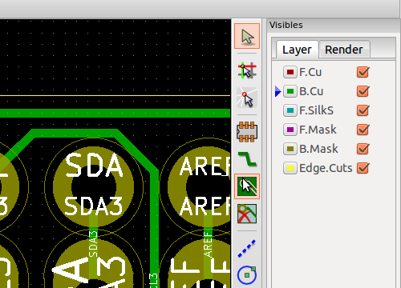
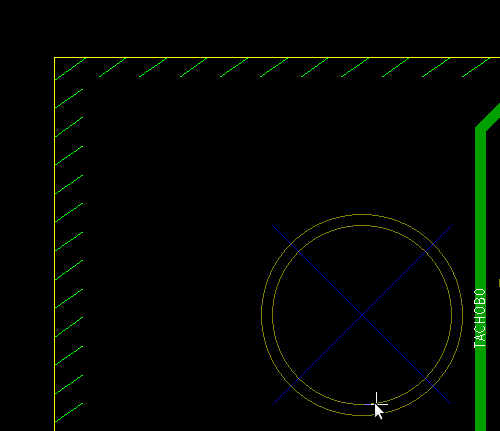

# Creating a Copper Pour

This is a much shorter version of this [tutorial](https://www.wayneandlayne.com/blog/2013/02/26/kicad-tutorial-copper-pours-fills/)

First select the copper pour tool

Highlight the area you want the copper pour

