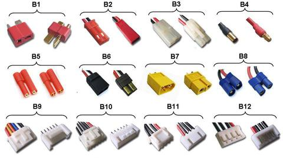

# Power Connectors

## B1 - Deans (T) type main connector

Used for main connection to speed controllers and motors. Used for medium to high current draw.

## B2 - JST / BEC type main connector

Used for main connection to speed controllers and motors. Used for low current draw

## B3 - Tamiya main battery plug

Usually used on Car and Boat batteries (NiCd / NiMh) - Female & Male

## B4 - Bullet Connectors

Single wire connectors, available in a range of different sizes to suit current draw / load requirements from 2mm to 8mm

## B5 - HXT Connectors

Available in 3.5mm and 4.00mm sizes. Used for main battery connectors for medium / high power applications

## B6 - Traxxas Connectors

Mainly used on high current draw car and boat batteries

## B7 - XT60 Connectors

Used for high current draw battery connections

## B8 - EC3 Connectors

Used for high current draw battery connections

## B9 - Flight Power / Thunder Power (FP / TP) LiPo Balance Charger plug

## B10 - Hyperion / PolyQuest (HP / PQ) LiPo Balance Charger plug

## B11 - JST-XHR (XH) LiPo Balance Charger plug

## B12 - JST-EHR (EH) LiPo Balance Charger plug

[Original Reference](https://www.hobbywingdirect.com/blogs/news/14906981-rc-101-battery-balance-connector-type)
