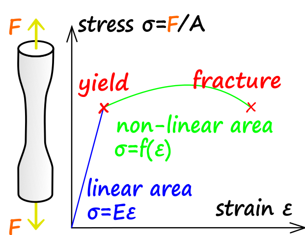

# Strength of Materials (or Mechanics of Materials)

## References

- [Wikipedia: strength of materials](https://en.wikipedia.org/wiki/Strength_of_materials)
- [Wikipedia: engineering yield](https://en.wikipedia.org/wiki/Yield_(engineering))
- [Wikipedia: mechanical properties](https://en.wikipedia.org/wiki/List_of_materials_properties#Mechanical_properties)

## Stress

Uniaxial stress is $\sigma = \frac{F}{A}$ where $F$ is force (N) and $A$ is area ($m^2$)

- Compressive stress (squash)
- Tensile stress (pull)
- Shear stress (scissors)

## Strength Terms

- Yield strength: lowest stress that produces permanent deformation
- Compressive strength: compressive stress that leads to failure
- Tensile strength: tensile stress that leads to failure
- Fatigue strength: measure of material strength un cyclic loads
- Impact strength: capability of material to withstand suddenly applied loads and is expressed in terms of energy

## Tensile Strength

Ultimate tensile strength (UTS) is the ability of a material to withstand loads which try
to elongate it. A tensile test records a materials engineering stress verse strain.
The **highest** point of the stress-strain curve is the UTS.

# PLA vs ABS

- Average tensile strengths of 28.5 MPa for ABS and 56.6 MPa for PLA
- Average elastic moduli of 1807 MPA for ABS and 3368 MPa for PLA

So what you can take away from this is, PLA is stronger, but more brittle (likely
to fracture especially under impact loads).
