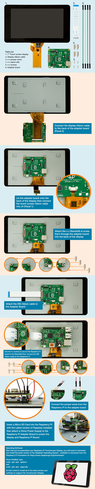

## Assembly



## Kiosk Mode for LightDM

```bash
pi@raspberrypi:~ $ cat ~/.config/lxsession/LXDE-pi/autostart
# turn off power management so screen doesn't go blank
@xset s off
@xset -dpms
@xset s noblank
# @matchbox-window-manager &
# @matchbox-keyboard --daemon &

# @chromium-browser --incognito -noerrdialogs --kiosk http://localhost/

# Note, the multiple http's set multiple tabs
# BUT kiosk only allows 1 window with no tabs, BUT you can't accidentally
# close the browser in kiosk
@chromium-browser --incognito --kiosk --start-maximized  -noerrdialogs http://pi-hole.local/admin/index.php http://plex.local:8080
```

If you make changes and what them to take effect now:

```bash
sudo service lightdm restart
```

# LCD Brightness

`root` owns it and I want `pi` to be able to adjust it too. Create a udev rule
`/etc/udev/rules.d/80-backlight.rules`:

```bash
SUBSYSTEM=="backlight" RUN+="/bin/chmod 0666 /sys/class/backlight/%k/brightness /sys/class/backlight/%k/bl_power"
```

`root` will still own it, but anyone can set it to a value between 1-255. I find
50 is really good for inside.

```bash
echo 50 > /sys/class/backlight/rpi_backlight/brightness
```

# Rotating Display

## Simple Flip

Generally you end up with the LCD mounted upside-down because people don't
pay attention to details. Simple solution to flip the LCD is to
put `lcd_rotate=2` in `/boot/config.txt` and the screen will turn upside-down.

## Portrait View (90 degree rotation)

However I wanted to put it into portrait view (90 deg turn):

```bash
xinput --set-prop 'FT5406 memory based driver' 'Coordinate Transformation Matrix' 0 1 0 -1 0 1 0 0 1
```

Note, if sshing in do: `DISPLAY=:0.0 xinput ...`

- [fixing touch screen](https://www.raspberrypi.org/forums/viewtopic.php?f=108&t=120793)
- [final solution](https://www.raspberrypi.org/forums/viewtopic.php?t=172025)

# Disable Touchscreen

To disable the touchscreen capability do add `tbd` to `/boot/config.txt`.

# nodm Config

I disabled the virtual keyboard because it takes up a lot of screen and isn't
really useful (big fingers and small keys). I type one letter every 10 seconds. :)

The file is located: `/home/pi/.xsession`

```bash
#!/bin/bash
xset s off
xset -dmps
xset s noblank
exec matchbox-window-manager  -use_titlebar no &
#exec matchbox-keyboard &
xinput --set-prop 'FT5406 memory based driver' 'Coordinate Transformation Matrix' 0 1 0 -1 0 1 0 0 1

chromium-browser --incognito -noerrdialogs http://pi-hole.local/admin/index.php http://localhost:8080
```
