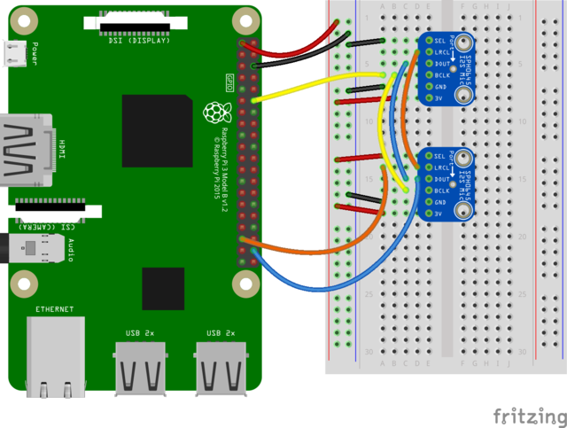

# Adafruit I2S MEMS Microphone Breakout

## Wiring

- **BCLK**: the bit clock, also known as the data clock or just 'clock' - comes from the I2S master to tell the microphone its time to transmit data. This should run at 2-4 MHz but we've found you can often run it a little slower and it'll work fine
- **DOUT**: the data output from the mic!
- **LRCLK**: the left/right clock, also known as WS (word select), this tells the mic when to start transmitting. When the LRCLK is low, the left channel will transmit. When LRCLK is high, the right channel will transmit.
- **SEL**: the channel select pin. By default this pin is low, so that it will transmit on the left channel mono. If you connect this to high logic voltage, the microphone will instantly start transmitting on the right channel.

Setting on mic `SEL` pin HIGH and the other LOW will put them on different channels, either right or left.

## Software

TBD

# References

- [Adafruit Tutorial](https://learn.adafruit.com/adafruit-i2s-mems-microphone-breakout?view=all)
