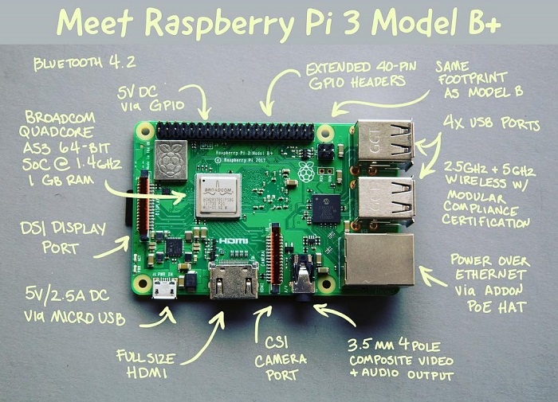

Hardware
========

:date: 2016-02-28
:summary: Accessing RPi hardware

Pinouts
-------

Depending on the version of the rpi you have, there are different
pinouts for the different versions. A great resource is
`Pinout <http://pi.gadgetoid.com/pinout>`__ to figur out what pin is
what.

.. figure:: pics/pinout.jpeg
    :width: 300px

.. figure:: pics/pi-zero-pinout.jpeg
    :width: 300px

.. figure:: pics/pi-zero-bcm-pinout.jpeg
    :width: 300px

Lights
------

The main indicators are the lights on the front corner of the board.
These are::

    OK (green): The board is active (blinks off when accessing the SD card)
    PWR (red): The board is successfully powered from USB
    FDX (green): Network is full-duplex
    LNK (green): The network cable is connected (blinks off when transferring data to/from the network)
    10M (yellow): Lit when the board is using a 100Mbps link, not lit when using a 10Mbps

Temperature
-------------

You can check the temperature by::

    vcgencmd measure_temp

You can setup a fan to turn on/off with this little `program <https://hackernoon.com/raspberry-pi-temperature-controlled-fan-2aa0de72a564>`_:

.. code-block:: bash

    #!/bin/sh
    timestamp() {
        date +”%Y-%m-%d %T”
    }
    LOGDIR=”/var/log/fan.log”
    VALUE=42
    TEMP=`vcgencmd measure_temp | cut -c6,7`
    STATUS=`cat /sys/class/gpio/gpio2/value`

    echo `timestamp` ” Info: Temperature: $TEMP”>>$LOGDIR

    if [ $TEMP -ge $VALUE ] && [ $STATUS -eq 0 ]; then
        echo `timestamp` ” Warning: Fan started.”>>$LOGDIR
        echo ”1”>/sys/class/gpio/gpio2/value
    elif [ $TEMP -le $VALUE ] && [ $STATUS -eq 1 ]; then
        echo `timestamp` ” Warning: Fan stopped.”>>$LOGDIR
        echo ”0”>/sys/class/gpio/gpio2/value
    fi

There is also a Node.js `version <https://www.npmjs.com/package/rpi-fan-controller>`_
that does a similar thing.

Power
------

`Power <https://www.raspberrypi.org/help/faqs/#power>`_

=============================== ==========  ==========================================  ==============================================
Product                            PSU          Maximum USB peripheral current draw            Typical bare-board active current consumption
=============================== ==========  ==========================================  ==============================================
Raspberry Pi Model A             700mA                500mA                                    200mA
Raspberry Pi Model B             1.2A                500mA                                    500mA
Raspberry Pi Model A+            700mA                500mA                                    180mA
Raspberry Pi Model B+            1.8A                600mA/1.2A (switchable)                    330mA
Raspberry Pi 2 Model B           1.8A                600mA/1.2A (switchable)                    ?
=============================== ==========  ==========================================  ==============================================

USB Camera
----------

To use the Logitech C270 camera you need to add your user (pi in this
case) to the video group::

    sudo usermod -a -G video pi

For other users, just change pi to the correct username. Then make sure
the driver is loaded::

    sudo modprobe uvcvideo

You can double check it works by grabbing an image::

    sudo apt-get install fswebcam

    fswebcam image.jpg

If an image appeared, then all is good.
