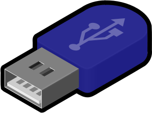

# Thumb Drive

This is a summary of the reference below. The assumptions are:

- this is a removable thumb drive
- format is simple FAT32

```bash
$sudo mkdir -p /media/<username>/usb
$sudo chown <username> /media/<username>/usb
$sudo chmod 0777 /media/<username>/usb
```

where `<username>` is the name of the user account you want to give access too.
You can also call the folder anything you want, but this is just `usb`. The
permissions are also set to anyone can read, write or execute anything in that
folder.

```bash
$dmesg
[snip]
[95921.903363] usb-storage 1-2.2:1.0: USB Mass Storage device detected
[95921.903445] scsi host5: usb-storage 1-2.2:1.0
[95922.902013] scsi 5:0:0:0: Direct-Access USB DISK 2.0 PMAP PQ: 0 ANSI: 6
[95922.902347] sd 5:0:0:0: Attached scsi generic sg2 type 0
[95923.714434] sd 5:0:0:0: [sdc] 15133248 512-byte logical blocks: (7.74 GB/7.21 GiB)
[95923.714639] sd 5:0:0:0: [sdc] Write Protect is off
[95923.714642] sd 5:0:0:0: [sdc] Mode Sense: 23 00 00 00
[95923.714848] sd 5:0:0:0: [sdc] No Caching mode page found
[95923.714851] sd 5:0:0:0: [sdc] Assuming drive cache: write through
[95923.719842] sdc: sdc1
[95923.721331] sd 5:0:0:0: [sdc] Attached SCSI removable disk
[/snip]
```

Here, we see the thumb drive was identified as `sdc1`, it may be different on your
system. So let's make an entry in `fstab` so we can easily mount it.

```bash
$sudo nano /etc/fstab

/dev/sdc1 /home/storage auto user,umask=000,utf8,noauto 0 0
```

Now mount the thumb drive with: `$mount /dev/sdc1` or `$mount /media/<username>/usb`

# References

- [How to mount a USB stick as a non-root user with write permission](https://linuxnewbieguide.org/how-to-mount-a-usb-stick-as-a-non-root-user-with-write-permission/)
