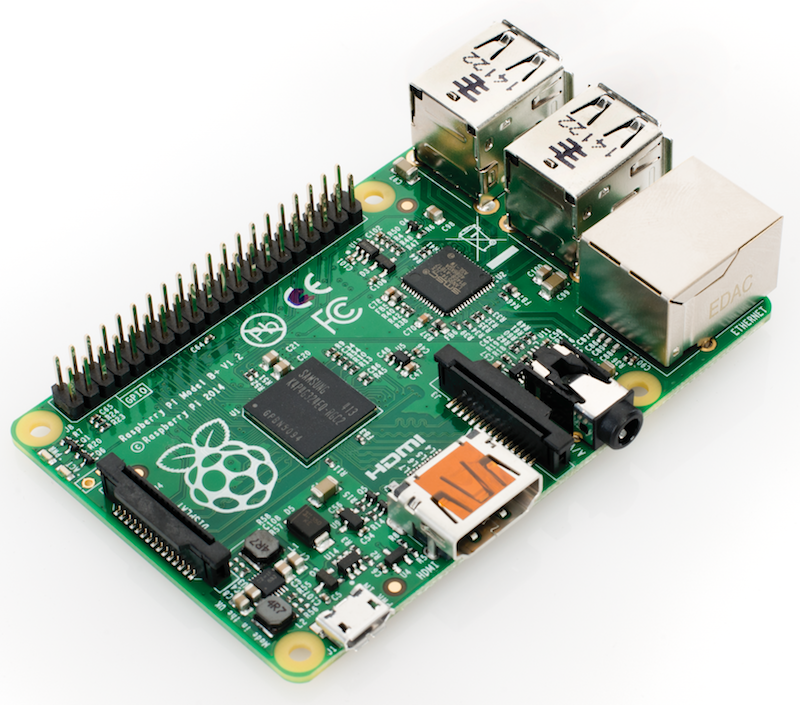

Hardware
========

:date: 2016-02-28
:summary: Accessing RPi hardware

Pinouts
-------

Depending on the version of the rpi you have, there are different
pinouts for the different versions. A great resource is
`Pinout <http://pi.gadgetoid.com/pinout>`__ to figur out what pin is
what.

.. figure:: pics/pinout.jpeg
    :width: 300px

Lights
------

The main indicators are the lights on the front corner of the board.
These are::

    OK (green): The board is active (blinks off when accessing the SD card)
    PWR (red): The board is successfully powered from USB
    FDX (green): Network is full-duplex
    LNK (green): The network cable is connected (blinks off when transferring data to/from the network)
    10M (yellow): Lit when the board is using a 100Mbps link, not lit when using a 10Mbps

Power
------

`Power <https://www.raspberrypi.org/help/faqs/#power>`_

=============================== ==========  ==========================================  ==============================================
Product                            PSU          Maximum USB peripheral current draw            Typical bare-board active current consumption
=============================== ==========  ==========================================  ==============================================
Raspberry Pi Model A             700mA                500mA                                    200mA
Raspberry Pi Model B             1.2A                500mA                                    500mA
Raspberry Pi Model A+            700mA                500mA                                    180mA
Raspberry Pi Model B+            1.8A                600mA/1.2A (switchable)                    330mA
Raspberry Pi 2 Model B           1.8A                600mA/1.2A (switchable)                    ?
=============================== ==========  ==========================================  ==============================================

USB Camera
----------

To use the Logitech C270 camera you need to add your user (pi in this
case) to the video group::

    sudo usermod -a -G video pi

For other users, just change pi to the correct username. Then make sure
the driver is loaded::

    sudo modprobe uvcvideo

You can double check it works by grabbing an image::

    sudo apt-get install fswebcam

    fswebcam image.jpg

If an image appeared, then all is good.
