# INS Errors

## Accelerometers

- Sensitivity of a sensor to x-axis inputs ($S_x$), this is repeated for y and z-axis
- Sensitivity of a sensor to x-axis and y-axis inputs ($M_{xy}$), this is repeated for all axis combinations

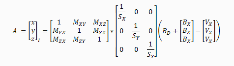

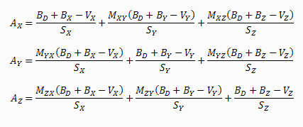

Bias correction can be done by finding average offsets over a period of time.
Capturing scaling issues and axis misalignments requires more complex testing
like 4-point or 6-point tumble testing respectively.

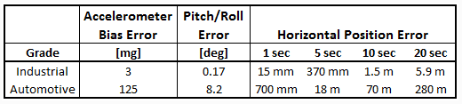

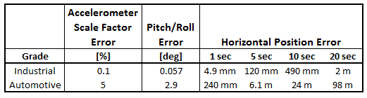

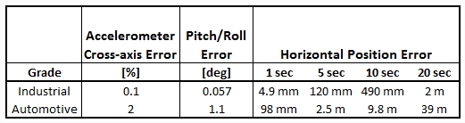

## Gyroscopes

Gyro errors have the largest impact on INS performance. Gyros have a random walk
component of error that cannot be calibrated out using standard methods. 

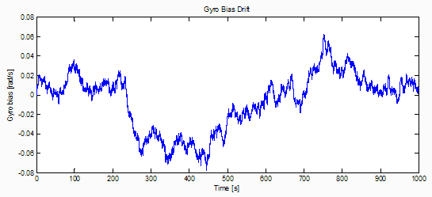

Scale factor errors can be calibrated out by spinning a gyro around each axis at a known
rate and using a linear least squares to calcuate the best fit.

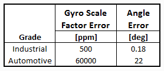

Gyros do exhibit some sensitivity to accelerations

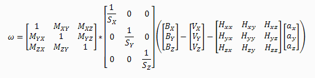

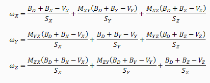

## Magnetometers

Magnetometers are strongly influenced by temperature which effects their scaling and bias
error terms.

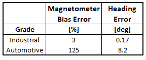

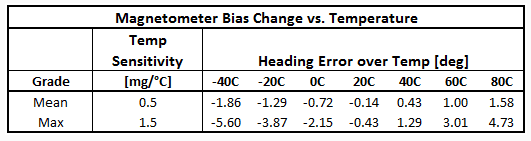

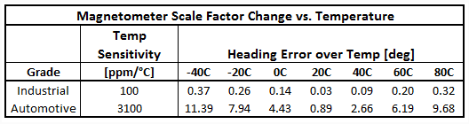

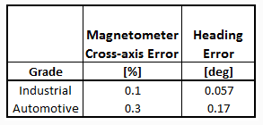

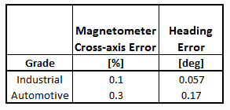

## Temperature

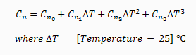

# References

- [Vectornav sensor calibration](https://www.vectornav.com/support/library/calibration)
