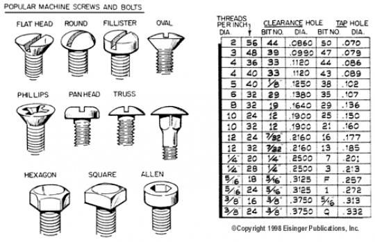

# Machine Screws

:date: 2017-01-16

A good table of sizes is [here](static/TapDrillSizes.pdf)

- [metric converstion](static/metric-conversions.pdf)

**STANDARD** thread size refers to a thread measurement system commonly
used in the United States called the \'Unified Thread Standard\'. This
system uses two numbers to identify thread size, for example: 1/4-20 or
2-56.

The **first number** references to the major diameter of the screw
(major diameter is the outside diameter of the screw measuring on the
outside of the threads, minor diameter is the smaller shank diameter,
measuring between the threads). Larger screw sizes typically use a
fraction in inches to identify major diameter, so a 1/4-20 screw has a
major diameter of 1/4\". Smaller screw sizes will use a \'gauge\' number
such as 0, 1, 2, 3, 4, 6, 8, 10, etc., to identify major diameter.

The following formulas can be used to translate the gauge number into
decimal inches or metric (or use cross reference chart below).

Where $n$ equals gauge number:

$n * 0.013 + 0.06 =$ major diameter in decimal inches\
$n * 0.3302 + 1.524 =$ major diameter in millimeters

The **second number** (80, 72, 64, 56, 32, 20, etc.) specifies the
number of threads over a distance of 1\" (25.4mm).

So using the above information, a standard thread size of 2-56 has a
major diameter of:

0.086\" (2 * 0.013 + 0.060)\
2.184mm (2 * 0.3302 + 1.524)

with 56 threads per 1\" (25.4mm).

Following is a cross reference showing: gauge / decimal / metric:

| Guage               | Decimal             | Metric              |
|---------------------|---------------------|---------------------|
| 0                   | 0.060\"             | 1.524mm             |
| 1                   | 0.073\"             | 1.854mm             |
| 2                   | 0.086\"             | 2.180mm             |
| 3                   | 0.099\"             | 2.515mm             |
| 4                   | 0.112\"             | 2.845mm             |
| 5                   | 0.125\"             | 3.175mm             |
| 6                   | 0.138\"             | 3.505mm             |
| 8                   | 0.164\"             | 4.166mm             |

**METRIC** thread sizes also use two numbers to identify thread size,
for example: M3.5 x 0.60. The first number describes the major diameter
in millimeters. The second number designates the pitch of the
thread, which is basically the distance from any one point on a thread
to a corresponding point on the next thread. Following is a cross
reference chart showing how pitch relates to threads per inch (25.4mm):

-------- -------- -------- --------
0.30mm   84 3/4   0.60mm   42 1/4
0.35mm   72 1/2   0.70mm   36 1/4
0.40mm   63 1/2   0.75mm   33 3/4
0.45mm   56 1/2   0.80mm   31 3/4
0.50mm   50 3/4                 
-------- -------- -------- --------
