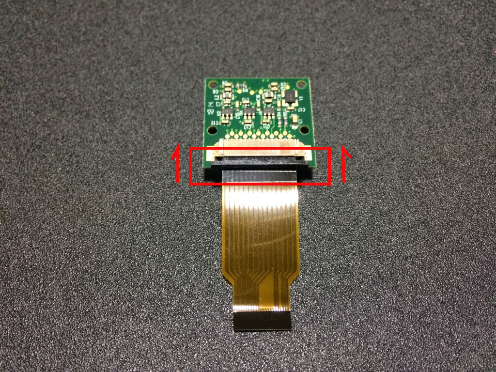
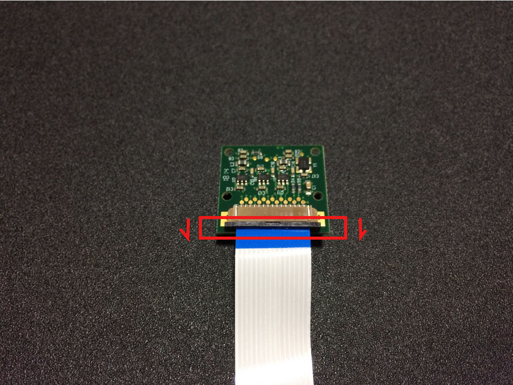
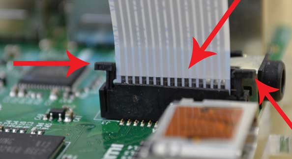
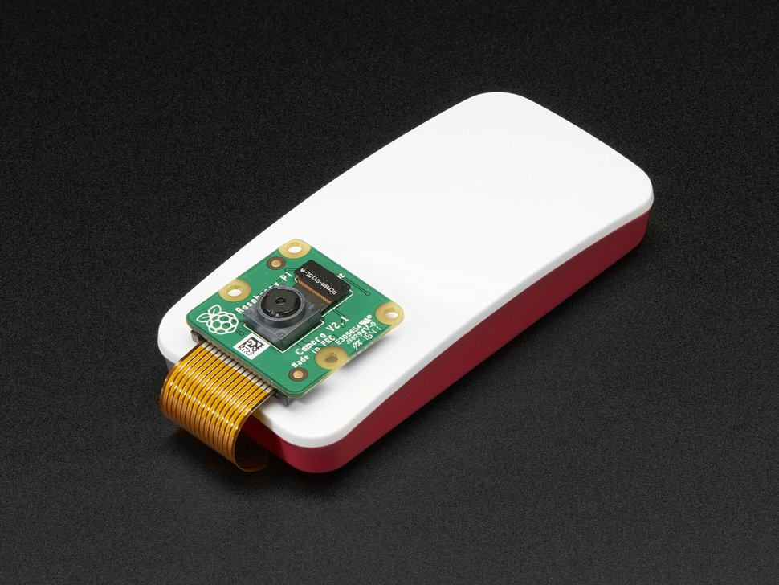
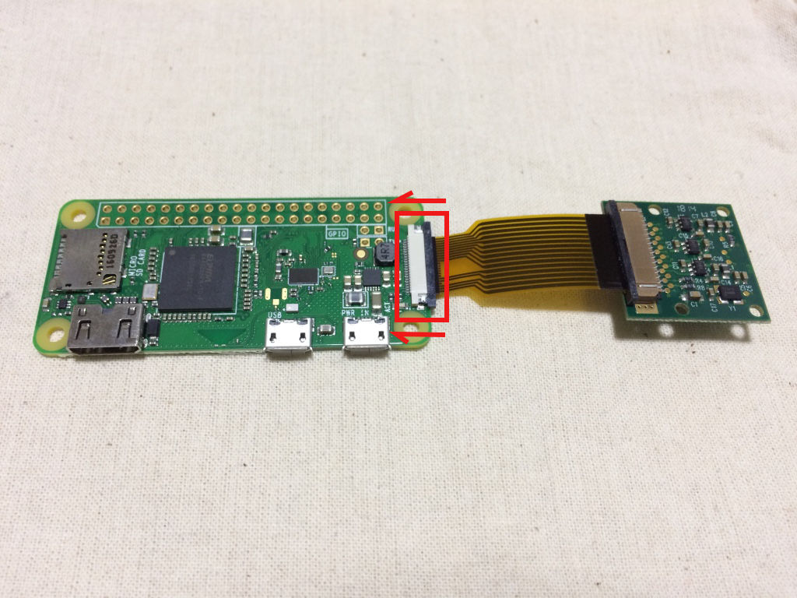
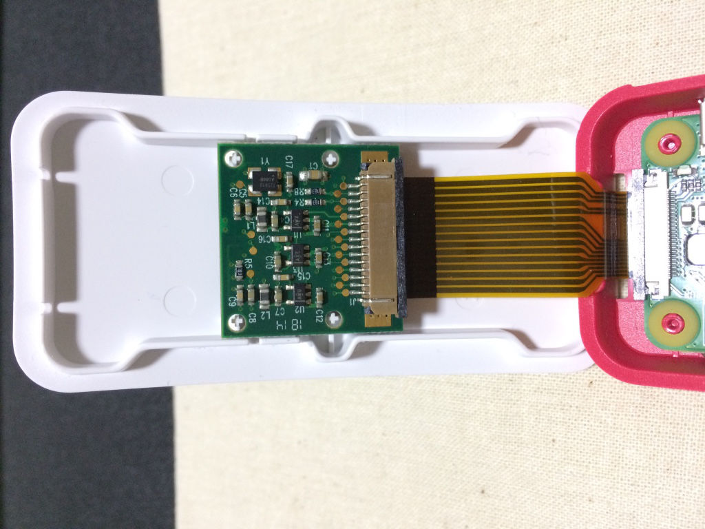
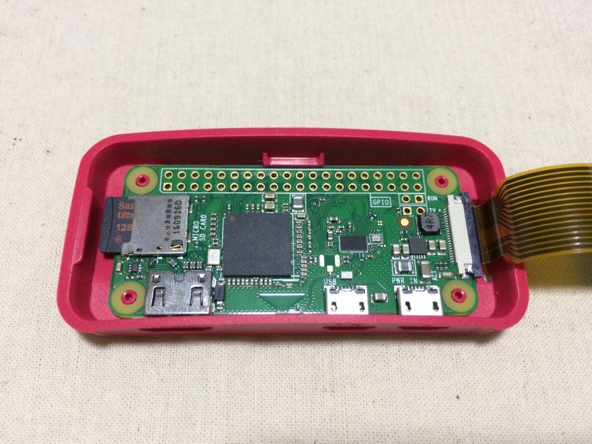

{width=75%}

# Raspberry Pi Camera

## Zero

{width=75%}

It can be confusing how to install the ribbon cable, but putting the tin leads of the
ribbon cable facing the green PCB (see picture) and the white (or blue) backing facing
away from the PCB.

## RPi 2-3

{width=75%}

The camera is the same, but on the board, you want the tin connections to be facing
away from the USB/Ethernet ports.

# Pi Zero Case

{width=75%}

{width=75%}

{width=75%}

{width=75%}

# Specs

The [Pi Camera]

  Param                 Camera v1                             Camera v2
  --------------------- ------------------------------------- -------------------------------------
  Size                  around 25 x 24 x 9 mm                 same
  Weight                3g                                    same
  Still resolution      5 Megapixels                          8 Megapixels
  Video modes           1080p30, 720p60 and 640 × 480p60/90   1080p30, 720p60 and 640 × 480p60/90
  Linux integration     V4L2 driver available                 V4L2 driver available
  C programming API     OpenMAX IL and others available       OpenMAX IL and others available
  Sensor                OmniVision OV5647                     Sony IMX219
  Sensor resolution     2592 × 1944 pixels                    3280 × 2464 pixels
  Sensor image area     3.76 x 2.74                           same
  Pixel size            1.4 µm x 1.4 µm                       same
  Optical size          1/4\"                                 same
  SLR lens equivalent   35 mm                                 same
  S/N ratio             36 dB                                 same
  Dynamic range         67 dB @ 8x gain                       same
  Sensitivity           680 mV/lux-sec                        same
  Dark current          16 mV/sec @ 60 C                      same
  Well capacity         4.3 Ke-                               same
  Fixed focus           1 m to infinity                       same

  [Pi Camera]: https://www.raspberrypi.org/documentation/hardware/camera/README.md

# Testing

Grab a still image:

	raspistill -o cam.jpg

Grab video:

	raspivid -o vid.h264
