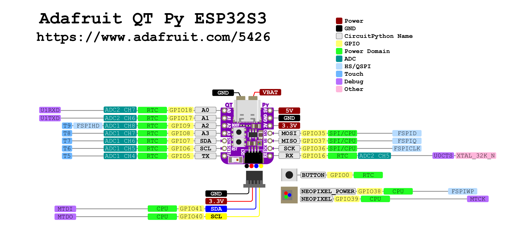

# Adafruit ESP Boards


| Adafruit QT Py   | Core      | Num Cores | MHz | RAM   | ROM   | FPU | WiFi | Bluetooth | Native USB | Price  |
|------------------|-----------|-----------|-----|-------|-------|-----|------|-----------|------------|--------|
| [ESP32-C3][1]    | RISC V    |  1        | 160 | 400KB | 4MB   | No  | Yes  | BLE       | No         | $9.95  |
| [ESP32-Pico][3]  | Tensilica |  2        | 240 | 2MB   | 8MB   | No  | Yes  | Classic/BLE | No       | $14.95 |
| [ESP32-S2][4]    | Tensilica |  1        | 240 | 2MB   | 4MB   | No  | Yes  | none      | Yes        | $12.50 |
| [ESP32-S3][2]    | Tensilica |  2        | 240 | 512KB | 8MB   | No  | Yes  | BLE       | Yes        | $12.50 |

- I2S and dual I2C on all boards
- USB-C and QWIIC connectors
- Add to `Additional Board Managers URL` with comma seperation: `https://raw.githubusercontent.com/espressif/arduino-esp32/gh-pages/package_esp32_dev_index.json`

[1]: https://www.adafruit.com/product/5405
[2]: https://www.adafruit.com/product/5426
[3]: https://www.adafruit.com/product/5395
[4]: https://www.adafruit.com/product/5325

## ESP32-S3



## Multicore Programming

```cpp
/*********
  Rui Santos
  Complete project details at https://randomnerdtutorials.com  
*********/

TaskHandle_t Task1;
TaskHandle_t Task2;

// LED pins
const int led1 = 2;
const int led2 = 4;

void setup() {
  Serial.begin(115200); 
  pinMode(led1, OUTPUT);
  pinMode(led2, OUTPUT);

  //create a task that will be executed in the Task1code() function, with priority 1 and executed on core 0
  xTaskCreatePinnedToCore(
    Task1code,   /* Task function. */
    "Task1",     /* name of task. */
    10000,       /* Stack size of task */
    NULL,        /* parameter of the task */
    1,           /* priority of the task */
    &Task1,      /* Task handle to keep track of created task */
    0);          /* pin task to core 0 */                  
  delay(500); 

  //create a task that will be executed in the Task2code() function, with priority 1 and executed on core 1
  xTaskCreatePinnedToCore(
    Task2code,   /* Task function. */
    "Task2",     /* name of task. */
    10000,       /* Stack size of task */
    NULL,        /* parameter of the task */
    1,           /* priority of the task */
    &Task2,      /* Task handle to keep track of created task */
    1);          /* pin task to core 1 */
  delay(500); 
}

//Task1code: blinks an LED every 1000 ms
void Task1code( void * pvParameters ){
  Serial.print("Task1 running on core ");
  Serial.println(xPortGetCoreID());

  for(;;){
    digitalWrite(led1, HIGH);
    delay(1000);
    digitalWrite(led1, LOW);
    delay(1000);
  } 
}

//Task2code: blinks an LED every 700 ms
void Task2code( void * pvParameters ){
  Serial.print("Task2 running on core ");
  Serial.println(xPortGetCoreID());

  for(;;){
    digitalWrite(led2, HIGH);
    delay(700);
    digitalWrite(led2, LOW);
    delay(700);
  }
}

void loop() {
  
}
```

- [programming](https://randomnerdtutorials.com/esp32-dual-core-arduino-ide/)
- [Ardiuno IDE setup](https://learn.adafruit.com/adafruit-qt-py-esp32-s2/arduino-ide-setup)
