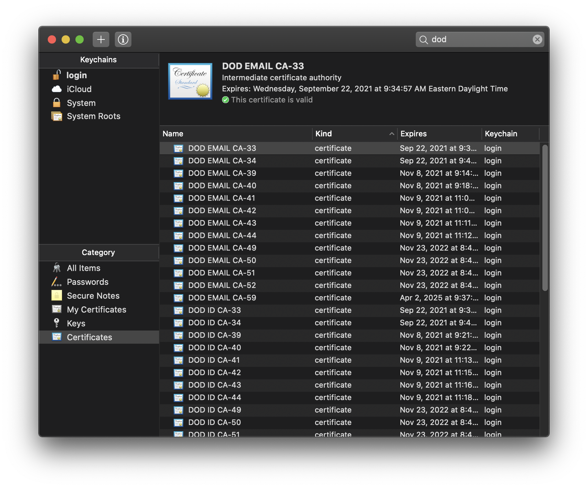

Unfortunately http://militarycac.com is an unruley mess, confusing, and outdated in places.
Below is basically Step 5 from [militarycac.com](https://militarycac.com/macnotes.htm) 
instructions.



1. You do not need any software (e.g., CAC enabler) to use the CAC and SCR3310v2 
reader in macOS 10.15.5
1. Go to keychains and delete all DOD keys (select and delete)
    - Note: keychains no longer shows the CAC PKI cert like it use too, but that is
    ok, it will still work
1. Then download these and double clicking on them. Note, these are they same 
as downloading the [AllCerts.zip](https://militarycac.com/maccerts/AllCerts.zip) and 
installing those certs. 
    - https://militarycac.com/maccerts/AllCerts.p7b
    - https://militarycac.com/maccerts/RootCert2.cer
    - https://militarycac.com/maccerts/RootCert3.cer
    - https://militarycac.com/maccerts/RootCert4.cer
    - https://militarycac.com/maccerts/RootCert5.cer
1. You need to manually trust the DoD Root CA 2, 3, 4, & 5 certificates.
    - Double click each of the DoD Root CA certificates, select the triangle next to 
    *Trust*, in the When using this certificate: select *Always Trust*
    - The red X should change to a blue plus
1. Make sure you have the following certs:
```
DOD EMAIL CA-33 through DOD EMAIL CA-34
DOD EMAIL CA-39 through DOD EMAIL CA-44
DOD EMAIL CA-49 through DOD EMAIL CA-52
DOD EMAIL CA-59
DOD ID CA-33 through DOD ID CA-34
DOD ID CA-39 through DOD ID CA-44
DOD ID CA-49 through DOD ID CA-52
DOD ID CA-59
DOD ID SW CA-35 through DOD ID SW CA-38
DOD ID SW CA-45 through DOD ID SW CA-48
DoD Root CA 2 through DoD Root CA 5
DOD SW CA-53 through DOD SW CA-58
DOD SW CA-60 through DOD SW CA-61
```

## NGA

1. Install [citrix workspace for mac](https://www.citrix.com/downloads/workspace-app/)
1. login to https://mydesktop.nga.mil/
    - Use the email cert to login

## References

- http://militarycac.com
