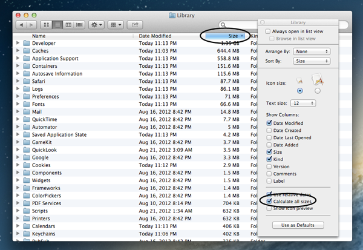

## Showing Hidden Files

```
cmd + shift + .
```

## Calculating Folder Sizes in Finder

Access window with `command` + `J` and select *Calculate all sizes*



# References

- [show hidden files](https://ianlunn.co.uk/articles/quickly-showhide-hidden-files-mac-os-x-mavericks/)
- [How can I clean up my user Library folder?](https://apple.stackexchange.com/a/61931)
