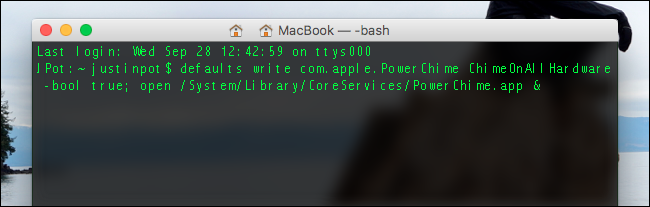

The PowerChime app (`/System/Library/CoreServices/PowerChime.app`) makes a chime
everytime you plug in your laptop ... I hate it.

- Off: `defaults write com.apple.PowerChime ChimeOnAllHardware -bool false;killall PowerChime`
- On: `defaults write com.apple.PowerChime ChimeOnAllHardware -bool true; open /System/Library/CoreServices/PowerChime.app &`

## References

- How to Geek: [How to Hear a Chime Every Time You Plug In Your MacBook Pro or Air](https://www.howtogeek.com/274191/how-to-hear-a-chime-every-time-you-plug-in-your-macbook-pro-or-air/)
