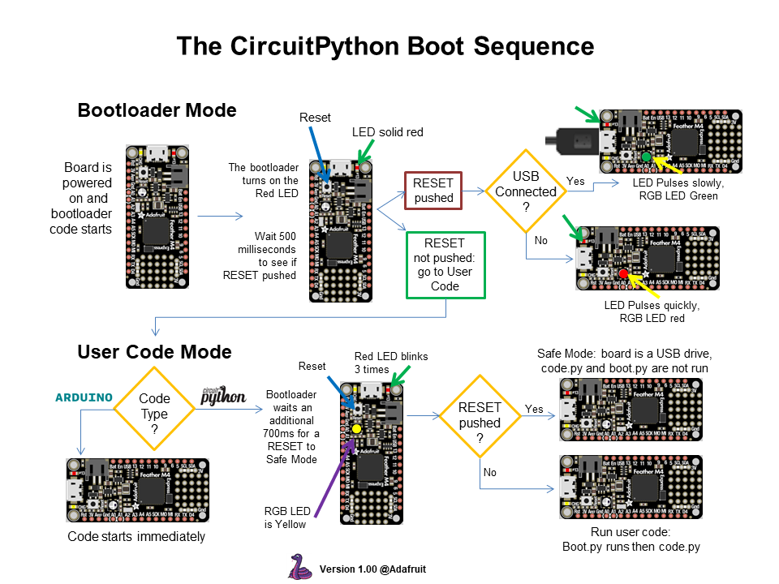
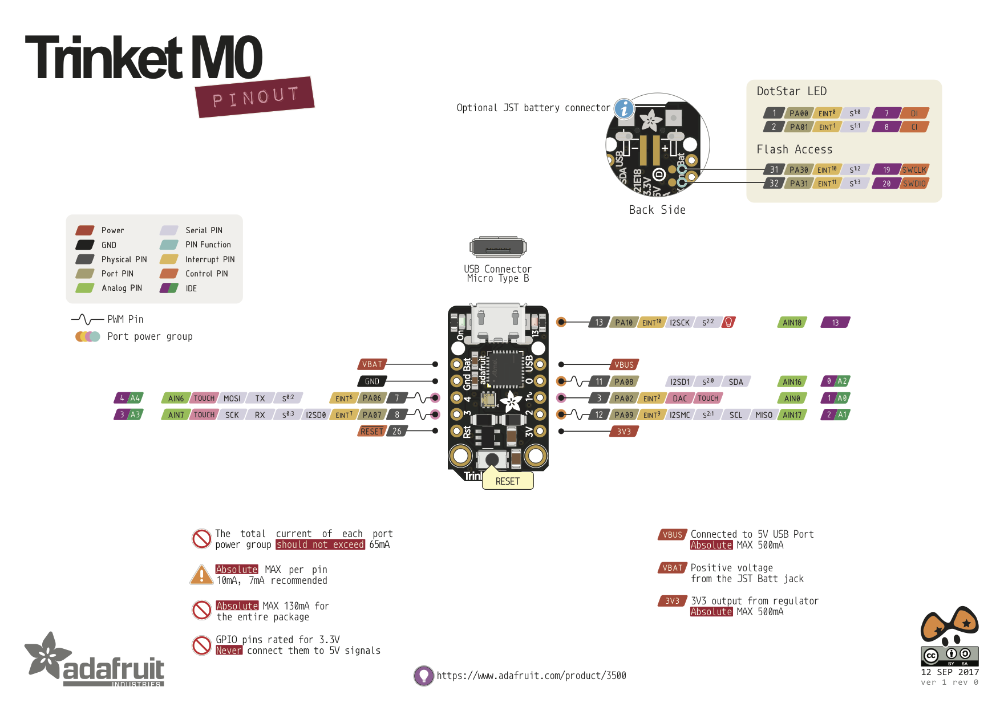

Adafruit's more advanced micro controllers come with a version of
[MicroPython](http://micropython.org/) installed on them called
 [Circuitpython](https://learn.adafruit.com/welcome-to-circuitpython/what-is-circuitpython).
I have worked with some of these micro controllers and really like them.

## What is it?

CircuitPython is a lean and efficient implementation of the Python 3 programming language that includes a small subset of the Python standard library and is optimised to run on microcontrollers and in constrained environments.

## Documentation

[Read the docs](https://circuitpython.readthedocs.io/en/latest/docs/index.html)

## Libraries

There are a lot of libraries available:

- [Adafruit's github repos](https://github.com/adafruit/Adafruit_CircuitPython_Bundle)
- [HCSR-04 drivers](https://github.com/mmabey/CircuitPython_HCSR04)

## Boot

## USB Serial Connection to REPL

You can interact with the board's REPL using `screen /dev/tty* 115200`. Linux serial is typically `/dev/ttyACM*` and Apple is `/dev/usbmodem*`. You can stop `screen` with `Ctl-a` then `k`.

# Adafruit CircuitPython Boards

|   | [Trinket M0](https://www.adafruit.com/product/3500) | [ItsyBitsy M0](https://www.adafruit.com/product/3727) | [ItsyBitsy M4](https://www.adafruit.com/product/3800) |
|---|---|---|---|
| Processor | ATSAMD21E18 32-bit Cortex M0+ | ATSAMD21G18 32-bit Cortex M0+ | ATSAMD51 32-bit Cortex M4 |
| MHz | 48 | 48 | 120 |
| RAM | 32KB | 32KB | 192 KB |
| ROM | 256KB | 256KB | 512KB |
| GPIO | 5 | 23 | 23 |
| 12b ADC | 3 | 11 | 12 |
| PWM | 2 | 13 | 18 |
| SPI FLASH | N/A | 2MB | 2MB |
| Price | $8.95 | $11.95 | $14.95 |

## Trinket M0

## ItsyBitsy M0

## ItsyBitsy M4

