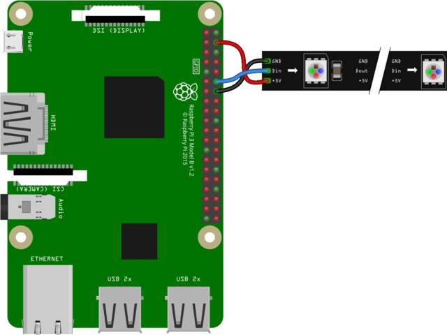

```python
import time
import board
import neopixel

# import adafruit_rtttl

# Trinket M0
# ----------------------------------
# ATSAMD21E18 32-bit Cortex M0+
# 256KB Flash
# 32 KB RAM
# 48 MHz 32 bit processor
# ---------------------------------


class Pixels:
    RED = (255, 0, 0)
    YELLOW = (255, 150, 0)
    GREEN = (0, 255, 0)
    CYAN = (0, 255, 255)
    BLUE = (0, 0, 255)
    PURPLE = (180, 0, 255)

    def __init__(self, num_pixels=1, bright=0.3):
        self.pixels = neopixel.NeoPixel(
            board.A0,
            num_pixels,
            brightness=bright,
            auto_write=False
        )

    def fill(self, color):
        """
        color - (r,g,b) with values of 0-255
        """
        self.pixels.fill(color)
        self.pixels.show()

p = Pixels(bright=0.1)

while True:
    print("Loop")

    for c in [Pixels.RED, Pixels.YELLOW, Pixels.GREEN, Pixels.CYAN, Pixels.BLUE, Pixels.PURPLE]:
        p.fill(c)
        time.sleep(1)
```

## Raspberry Pi



## References

- [Adafruit tutorial](https://learn.adafruit.com/circuitpython-essentials/circuitpython-neopixel)
- [Adafruit neopixel uber guide](https://learn.adafruit.com/adafruit-neopixel-uberguide)
