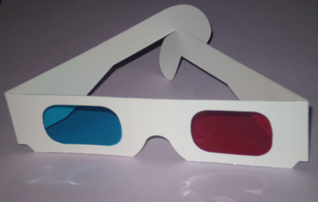
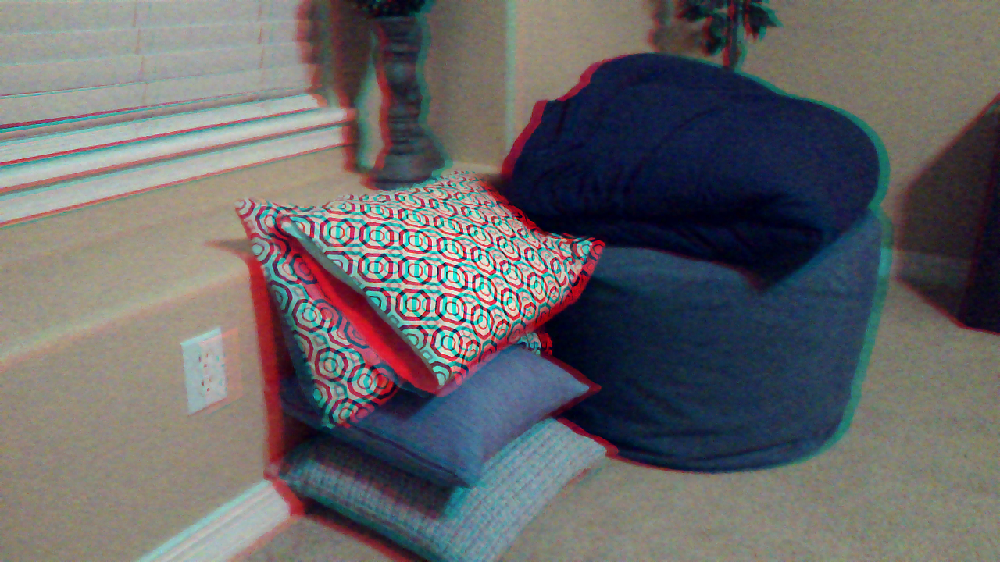

# Anaglyphs with Stereo Image Pairs using OpenCV

Anaglyph 3D is the name given to the stereoscopic 3D effect achieved by means of encoding each eye's image using filters of different (usually chromatically opposite) colors, typically red and cyan. Anaglyph 3D images contain two differently filtered colored images, one for each eye. When viewed through the "color-coded" "anaglyph glasses", each of the two images reaches the eye it's intended for, revealing an integrated stereoscopic image. The visual cortex of the brain fuses this into the perception of a three-dimensional scene or composition.

## Code Example

### Example

