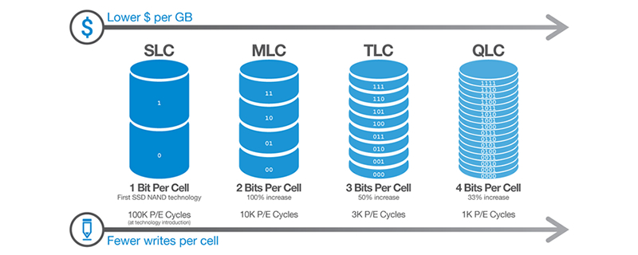
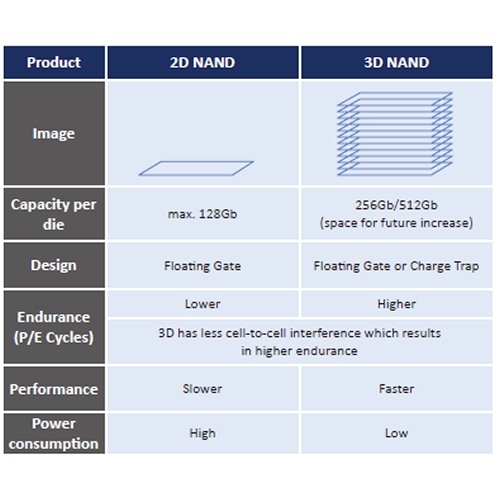

## SSD Types

- B and M key: SATA
- M Key: NVMe

## NAND Types

- SLC lasts longer with QLC wearing out faster
- SLC is slower with QLC being faster

- Using 3d NAND allowes faster performance with increased endurance and
lower power consumption
