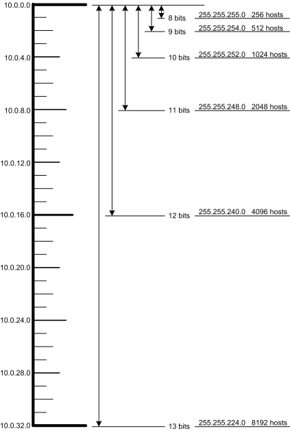

The IP address is a 32 bit number which provides 0 to 4,294,967,295
unique addresses on a network. This is chopped up into 4 8-bit octets
separated by a period.

0.0.0.0 to 0.0.0.255 is one octet which provide 256 addresses.

## Subnetwork

Chopping a large network up into smaller pieces is subnetworking.

-   beginning is always even, network id
-   ending is always odd, broadcast id
-   you can not use the network or broadcast id address, since they have
    special meaning
-   0.0.0.0/8 (0.0.0.0 to 0.255.255.255) not used
-   127.0.0.0/8 (127.0.0.0 to 127.255.255.255) used for loop back
    addresses
-   Number of hosts: 2\^bits - 2 where bits is the number of bits for
    the subnet and the -2 accounts for both the network and broadcast
    id\'s

You need to chop along clean binary division as shown below:


### Network Classes
------------------------------------------------------------------------------------------------

  --------------------------------------------------------------------------------
  Class   IP Range           Subnet Bits Mask Bits   Notes
  ------- ------------------ ----------- ----------- -----------------------------
  A       0.0.0.0 to         24          8           the first half of the address
          127.255.255.255                            space

  B       128.0.0.0 to       16          16          half the remaining address
          191.255.255.255                            space

  C       192.0.0.0 to       8           24          half the remaining address
          223.255.255.255                            space

  D       224.0.0.0 to       undefined   undefined   half the remaining address
          239.255.255.255                            space for multicast

  E       240.0.0.0 to       undefined   undefined   everything remaining
          255.255.255.255                            
  --------------------------------------------------------------------------------


### Private Subnetworks
-------------------------------------------------------------------

  ------------------------------------------------------------------------------
  Class   Subnet    Mask     IP               IP Range              Number of
          Bits      Bits                                            Hosts
  ------- --------- -------- ---------------- --------------------- ------------
  A       24        8        10.0.0.0/8       10.0.0.0 to           16,777,216
                                              10.255.255.255        

  B       20        12       172.16.0.0/12    172.16.0.0 to         1,048,576
                                              172.31.255.255        

  C       16        16       192.168.0.0/16   192.168.0.0 to        65,536
                                              192.168.255.255       

  C       16        16       169.254.0.0/16   169.254.0.0 to        65,536
                                              169.254.255.255       
  ------------------------------------------------------------------------------

The 169.254.0.0 addresses are only used when DHCP server is not
available.

## Address Bits

-   8 bits = 256 addresses (254 hosts, minus the network and broadcast
    id\'s)
-   9 bits = 512 addresses
-   10 bits = 1024 addresses
-   11 bits = 2048 addresses




## Masks

Typical home networks use 192.168.0.0/16 where the 16 indicates a 16-bit
mask giving addresses from 192.168.0.0 to 192.168.255.255. Since a
complete mask is 32-bits and each octet is 8-bits each, 16-bits uses the
bottom 2 octets or 192.168.x.x. An 8-bit mask would use the lower 3
octets or 192.x.x.x. A 24-bit mask would only use the bottom octet of
the address range, or 192.168.1.x.

-   8-bit mask: 255.0.0.0
-   16-bit mask: 255.255.0.0
-   24-bit mask: 255.255.255.0

## Calculator

- [IP address calculator](http://www.subnet-calculator.com)
- [Another one](http://jodies.de/ipcalc?)

```
192.168.0.1/16:
Address:   192.168.0.1           11000000.10101000 .00000000.00000001
Netmask:   255.255.0.0 = 16      11111111.11111111 .00000000.00000000
Wildcard:  0.0.255.255           00000000.00000000 .11111111.11111111
=>
Network:   192.168.0.0/16        11000000.10101000 .00000000.00000000 (Class C)
Broadcast: 192.168.255.255       11000000.10101000 .11111111.11111111
HostMin:   192.168.0.1           11000000.10101000 .00000000.00000001
HostMax:   192.168.255.254       11000000.10101000 .11111111.11111110
Hosts/Net: 65534                 (Private Internet)

192.168.1.1/24:
Address:   192.168.1.1           11000000.10101000.00000001 .00000001
Netmask:   255.255.255.0 = 24    11111111.11111111.11111111 .00000000
Wildcard:  0.0.0.255             00000000.00000000.00000000 .11111111
=>
Network:   192.168.1.0/24        11000000.10101000.00000001 .00000000 (Class C)
Broadcast: 192.168.1.255         11000000.10101000.00000001 .11111111
HostMin:   192.168.1.1           11000000.10101000.00000001 .00000001
HostMax:   192.168.1.254         11000000.10101000.00000001 .11111110
Hosts/Net: 254                   (Private Internet)
```

# References

- George Ou, [IP subnetting made
easy](http://www.techrepublic.com/blog/data-center/ip-subnetting-made-easy-125343/)
- wikipedia: [Private Subnetworks](http://en.wikipedia.org/wiki/Private_network)
- wikipedia: [Network Classes](http://en.wikipedia.org/wiki/Classful_network#Introduction_of_address_classes)
