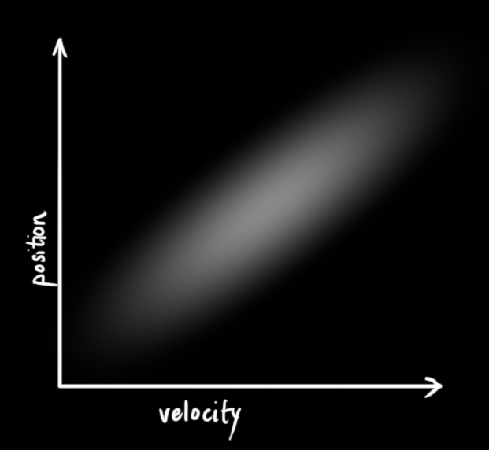
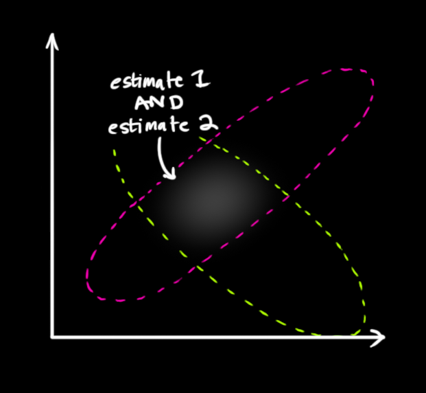
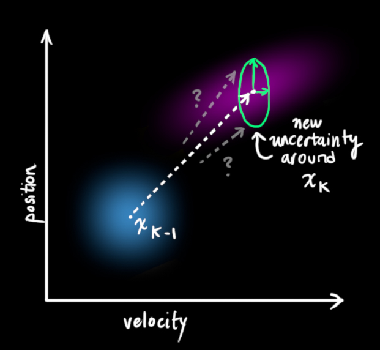
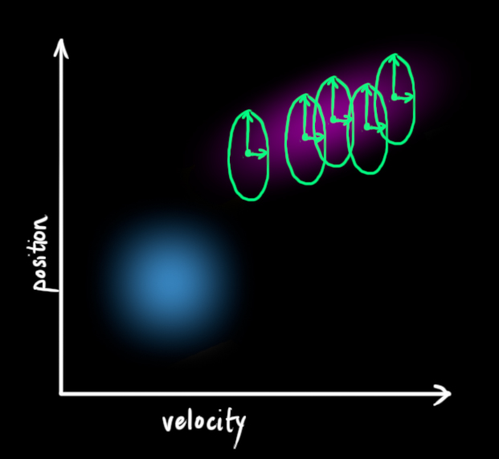

Some day I want to use this as a basis for something, but never have the time ... just go to the original website

# References

- Bzarg: [How a Kalman Filter Work](https://www.bzarg.com/p/how-a-kalman-filter-works-in-pictures/#more-491) [local copy](bzarg.pdf)
