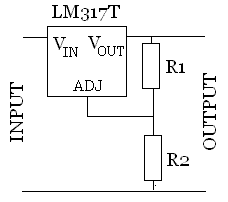
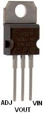

## LM317/LM338 Adjustable Regulators

- [Ref](http://www.reuk.co.uk/wordpress/electric-circuit/lm317-voltage-calculator/)

The LM317 (LM317T), and high current LM338 (LM338T) are voltage regulators which
can take an input voltage of 3-40 Volts DC, and output a fixed output voltage
from 1.2 to 37 Volts DC.

$$
V_{out} = 1.25*(1 + \frac{R_2}{R_1})
$$

  ------------------------------ ------------------------------- ---------------------------------
  **1.43V** R1 = 470, R2 = 68    **2.31V** R1 = 390, R2 = 330    **4.79V** R1 = 240, R2 = 680
  **1.47V** R1 = 470, R2 = 82    **2.36V** R1 = 270, R2 = 240    **5.04V** R1 = 330, R2 = 1000
  **1.48V** R1 = 370, R2 = 68    **2.37V** R1 = 370, R2 = 330    **5.05V** R1 = 270, R2 = 820
  **1.51V** R1 = 330, R2 = 68    **2.40V** R1 = 240, R2 = 220    **5.10V** R1 = 390, R2 = 1200
  **1.51V** R1 = 390, R2 = 82    **2.44V** R1 = 390, R2 = 370    **5.11V** R1 = 220, R2 = 680
  **1.52V** R1 = 470, R2 = 100   **2.50V** R1 = 470, R2 = 470    **5.14V** R1 = 180, R2 = 560
  **1.53V** R1 = 370, R2 = 82    **2.57V** R1 = 370, R2 = 390    **5.17V** R1 = 150, R2 = 470
  **1.56V** R1 = 330, R2 = 82    **2.61V** R1 = 220, R2 = 240    **5.24V** R1 = 470, R2 = 1500
  **1.57V** R1 = 270, R2 = 68    **2.65V** R1 = 330, R2 = 370    **5.30V** R1 = 370, R2 = 1200
  **1.57V** R1 = 470, R2 = 120   **2.66V** R1 = 240, R2 = 270    **5.52V** R1 = 240, R2 = 820
  **1.57V** R1 = 390, R2 = 100   **2.73V** R1 = 330, R2 = 390    **5.80V** R1 = 330, R2 = 1200
  **1.59V** R1 = 370, R2 = 100   **2.74V** R1 = 470, R2 = 560    **5.88V** R1 = 270, R2 = 1000
  **1.60V** R1 = 240, R2 = 68    **2.75V** R1 = 150, R2 = 180    **5.91V** R1 = 220, R2 = 820
  **1.63V** R1 = 330, R2 = 100   **2.76V** R1 = 390, R2 = 470    **5.92V** R1 = 150, R2 = 560
  **1.63V** R1 = 270, R2 = 82    **2.78V** R1 = 270, R2 = 330    **5.97V** R1 = 180, R2 = 680
  **1.64V** R1 = 390, R2 = 120   **2.78V** R1 = 220, R2 = 270    **6.04V** R1 = 470, R2 = 1800
  **1.64V** R1 = 220, R2 = 68    **2.84V** R1 = 370, R2 = 470    **6.06V** R1 = 390, R2 = 1500
  **1.65V** R1 = 470, R2 = 150   **2.92V** R1 = 180, R2 = 240    **6.32V** R1 = 370, R2 = 1500
  **1.66V** R1 = 370, R2 = 120   **2.96V** R1 = 270, R2 = 370    **6.46V** R1 = 240, R2 = 1000
  **1.68V** R1 = 240, R2 = 82    **2.97V** R1 = 240, R2 = 330    **6.81V** R1 = 270, R2 = 1200
  **1.71V** R1 = 330, R2 = 120   **3.03V** R1 = 330, R2 = 470    **6.92V** R1 = 150, R2 = 680
  **1.71V** R1 = 270, R2 = 100   **3.05V** R1 = 390, R2 = 560    **6.93V** R1 = 330, R2 = 1500
  **1.72V** R1 = 220, R2 = 82    **3.06V** R1 = 270, R2 = 390    **6.94V** R1 = 180, R2 = 820
  **1.72V** R1 = 180, R2 = 68    **3.06V** R1 = 470, R2 = 680    **7.02V** R1 = 390, R2 = 1800
  **1.73V** R1 = 470, R2 = 180   **3.08V** R1 = 150, R2 = 220    **7.10V** R1 = 470, R2 = 2200
  **1.73V** R1 = 390, R2 = 150   **3.13V** R1 = 220, R2 = 330    **7.33V** R1 = 370, R2 = 1800
  **1.76V** R1 = 370, R2 = 150   **3.14V** R1 = 370, R2 = 560    **7.50V** R1 = 240, R2 = 1200
  **1.77V** R1 = 240, R2 = 100   **3.18V** R1 = 240, R2 = 370    **8.07V** R1 = 330, R2 = 1800
  **1.81V** R1 = 270, R2 = 120   **3.25V** R1 = 150, R2 = 240    **8.08V** R1 = 150, R2 = 820
  **1.82V** R1 = 150, R2 = 68    **3.28V** R1 = 240, R2 = 390    **8.19V** R1 = 270, R2 = 1500
  **1.82V** R1 = 330, R2 = 150   **3.35V** R1 = 220, R2 = 370    **8.30V** R1 = 390, R2 = 2200
  **1.82V** R1 = 180, R2 = 82    **3.37V** R1 = 330, R2 = 560    **8.43V** R1 = 470, R2 = 2700
  **1.83V** R1 = 390, R2 = 180   **3.43V** R1 = 270, R2 = 470    **8.68V** R1 = 370, R2 = 2200
  **1.84V** R1 = 470, R2 = 220   **3.43V** R1 = 390, R2 = 680    **9.06V** R1 = 240, R2 = 1500
  **1.86V** R1 = 370, R2 = 180   **3.43V** R1 = 470, R2 = 820    **9.58V** R1 = 330, R2 = 2200
  **1.88V** R1 = 240, R2 = 120   **3.47V** R1 = 220, R2 = 390    **9.77V** R1 = 220, R2 = 1500
  **1.89V** R1 = 470, R2 = 240   **3.50V** R1 = 150, R2 = 270    **9.90V** R1 = 390, R2 = 2700
  **1.93V** R1 = 330, R2 = 180   **3.54V** R1 = 180, R2 = 330    **10.03V** R1 = 470, R2 = 3300
  **1.93V** R1 = 150, R2 = 82    **3.55V** R1 = 370, R2 = 680    **10.37V** R1 = 370, R2 = 2700
  **1.94V** R1 = 270, R2 = 150   **3.70V** R1 = 240, R2 = 470    **10.63V** R1 = 240, R2 = 1800
  **1.96V** R1 = 390, R2 = 220   **3.82V** R1 = 180, R2 = 370    **11.25V** R1 = 150, R2 = 1200
  **1.97V** R1 = 470, R2 = 270   **3.83V** R1 = 330, R2 = 680    **11.44V** R1 = 270, R2 = 2200
  **1.99V** R1 = 370, R2 = 220   **3.84V** R1 = 270, R2 = 560    **11.48V** R1 = 330, R2 = 2700
  **2.02V** R1 = 390, R2 = 240   **3.88V** R1 = 390, R2 = 820    **11.67V** R1 = 180, R2 = 1500
  **2.03V** R1 = 240, R2 = 150   **3.91V** R1 = 470, R2 = 1000   **11.83V** R1 = 390, R2 = 3300
  **2.06V** R1 = 370, R2 = 240   **3.92V** R1 = 220, R2 = 470    **12.40V** R1 = 370, R2 = 3300
  **2.08V** R1 = 330, R2 = 220   **3.96V** R1 = 180, R2 = 390    **12.71V** R1 = 240, R2 = 2200
  **2.10V** R1 = 220, R2 = 150   **4.00V** R1 = 150, R2 = 330    **13.75V** R1 = 330, R2 = 3300
  **2.12V** R1 = 390, R2 = 270   **4.02V** R1 = 370, R2 = 820    **15.31V** R1 = 240, R2 = 2700
  **2.13V** R1 = 470, R2 = 330   **4.17V** R1 = 240, R2 = 560    **16.25V** R1 = 150, R2 = 1800
  **2.16V** R1 = 330, R2 = 240   **4.33V** R1 = 150, R2 = 370    **16.53V** R1 = 270, R2 = 3300
  **2.16V** R1 = 370, R2 = 270   **4.36V** R1 = 330, R2 = 820    **16.59V** R1 = 220, R2 = 2700
  **2.19V** R1 = 240, R2 = 180   **4.40V** R1 = 270, R2 = 680    **18.44V** R1 = 240, R2 = 3300
  **2.23V** R1 = 470, R2 = 370   **4.43V** R1 = 220, R2 = 560    **19.58V** R1 = 150, R2 = 2200
  **2.25V** R1 = 150, R2 = 120   **4.44V** R1 = 470, R2 = 1200   **20.00V** R1 = 220, R2 = 3300
  **2.27V** R1 = 270, R2 = 220   **4.46V** R1 = 390, R2 = 1000   **23.75V** R1 = 150, R2 = 2700
  **2.27V** R1 = 330, R2 = 270   **4.50V** R1 = 150, R2 = 390    **24.17V** R1 = 180, R2 = 3300
  **2.29V** R1 = 470, R2 = 390   **4.51V** R1 = 180, R2 = 470    **28.75V** R1 = 150, R2 = 3300
  **2.29V** R1 = 180, R2 = 150    **4.63V** R1 = 370, R2 = 1000    
  ------------------------------- -------------------------------- ---------------------------------
