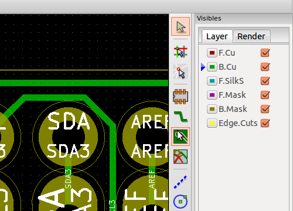
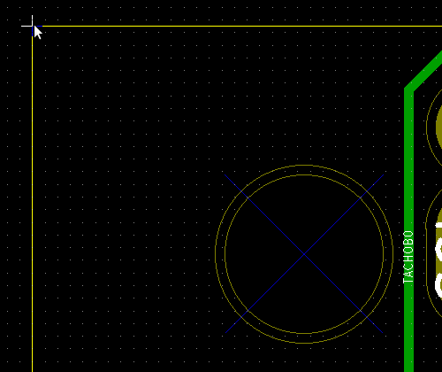
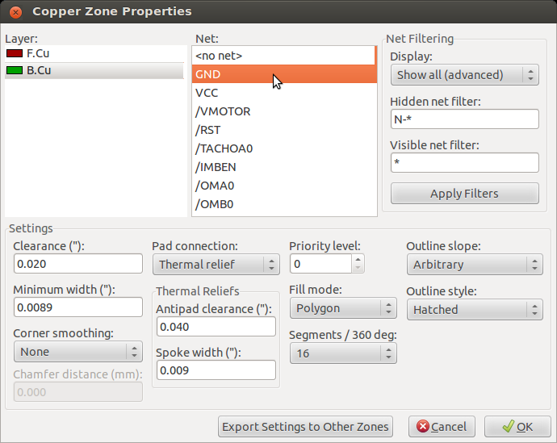
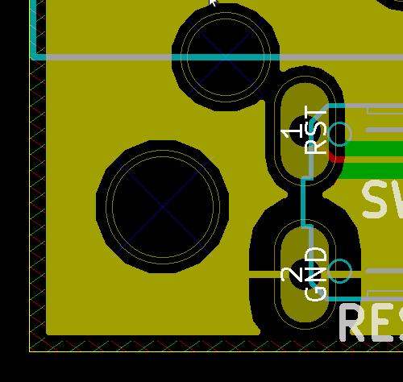

This is a much shorter version of this [tutorial](https://www.wayneandlayne.com/blog/2013/02/26/kicad-tutorial-copper-pours-fills/)

- First select the copper pour tool on the righthand side.

- Highlight the area you want the copper pour to fill

- Select the front of back copper fill and tie it to ground (GND)

- When done, you should see a hatching (red for front or green for back copper) around the area you selected.
- Now select “Zone outline”, then go to “Zones”->”Duplicate Zone” which will fill the the other side out for you

- Now your board has front/back copper pour
- If you need to remove it, right click on the copper pour and select remove
- When you are ready to put the pour back in, right click and fill
