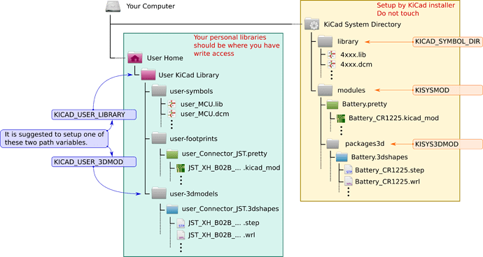
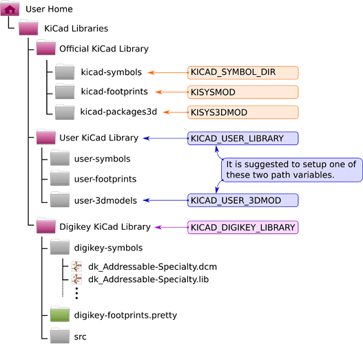

OMG Kicad is such a pain in the ass for setting up libraries to the point
of you want to yell at the developers ... but it is free, so I shouldn't
complain. But there is little excuse for poor documentation and no real
end user thought.

You can see the libraries at [kicad.github.io](https://kicad.github.io/).

## Standard Layout

## Github Layout

From *kicad main window* -> *preferences* -> *configure paths*

- KICAD_SYBMOL_DIR: symbols for schematic (`.lib`, `.dcm`)
- KISYSMOD: foorprint libraries (`.pretty`)
- KISYS3DMOD: 3D files of each part for rendering (`.step`, `.wrl`)
- KICAD_USER_LIBRARY: your own schematic symbols
- KICAD_USER_3DMOD: your own 3d rendered parts

**Note:** Make sure to copy the `fp-lib-table` from `kicad-footprints` to your 
project folder, otherwise you won't have footprints (so what do the preferences
do?)

# References

- Good [reference](https://forum.kicad.info/t/library-management-in-kicad-version-5/14636) from kicad forum
