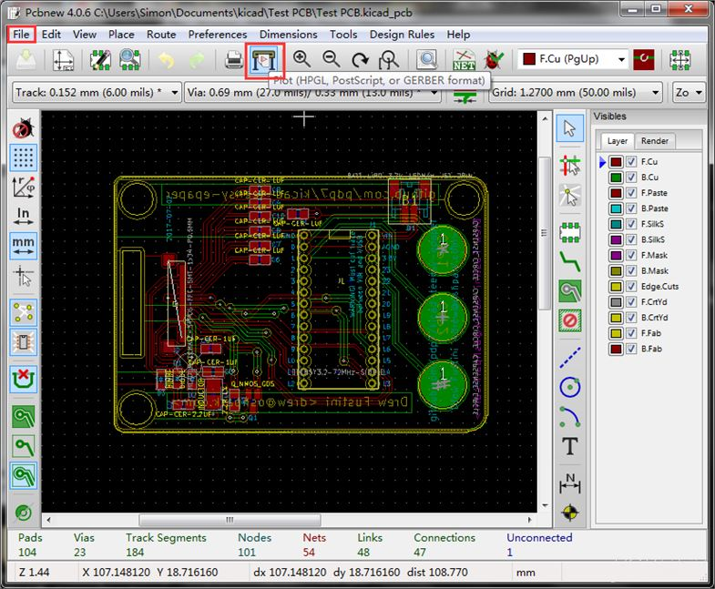
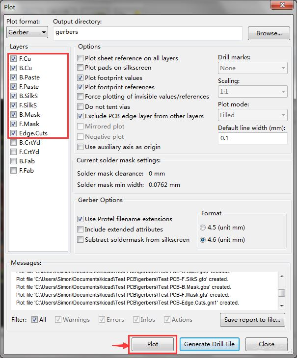
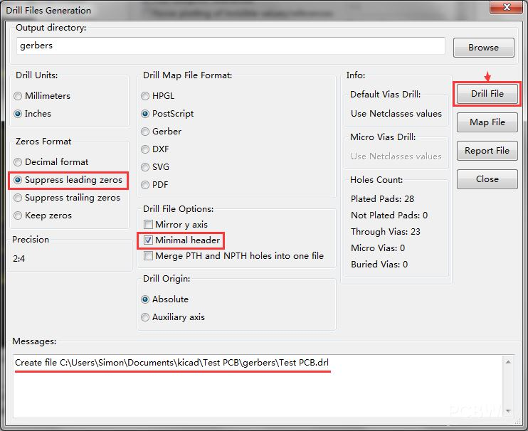

## Adding Libraries

1. Find the library you want on [KiCad Libraries](https://kicad.github.io/)
2. Download it
3. Add the path to the schematics editor

## Tutorials

- [Sparkfun's KiCad Overview](https://www.sparkfun.com/news/2041)
- [Sparkfun's library setup and how to create a custom footprint library](https://learn.sparkfun.com/tutorials/beginners-guide-to-kicad/creating-a-custom-kicad-footprint-library)
    - If you ever mess up your libraries, delete `fp-lib-table` and restart kicad.
    Kicad will setup the libraries back to the default values.
        - Windows 10: `C:\Users\Nathan\AppData\Roaming\kicad\fp-lib-table`
        - macOS: it is in the same folder as the project (\*.pro)

# Making a Gerber File for Production

[PCBWay tutorial](https://www.pcbway.com/blog/help_center/Generate_Gerber_file_from_Kicad.html)

1. From the project, open the pcb editor
    
1. In the pcb editor, select the plotter
    
1. Select the following layers
    
1. Then generate a drill file
    
1. Now take all of the files and zip them up. You can use a gerber viewer
to double check everything looks ok

# Gerber Viewer

Plot your PCB designs and zip up the files. Then drag/drop them on to: https://gerber-viewer.easyeda.com/
