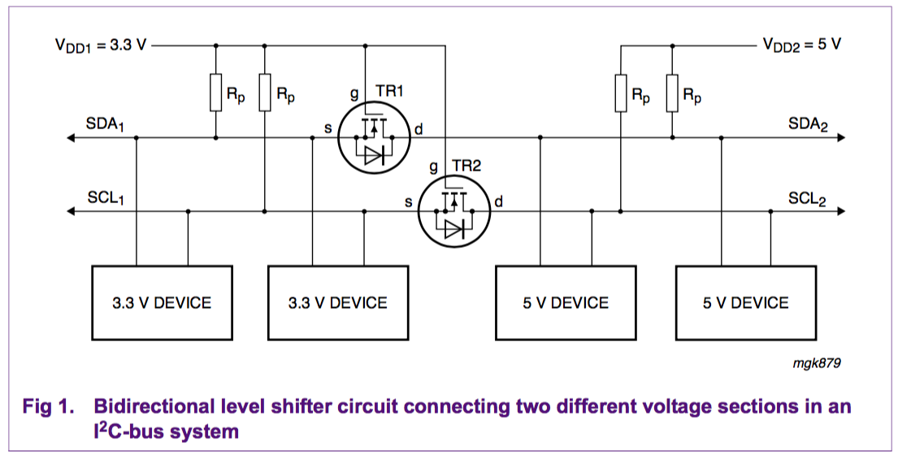

## Tech Document References
- [Phillips](phillips-level-shifting.pdf)
- [NXP](NXP-level-shifting.pdf)

## NXP Operation of the level shifter

The following three states should be considered during the operation of the level shifter:

1. No device is pulling down the bus line. The bus line of the ‘lower-voltage’ section is pulled up by its pull-up resistors Rp to 3.3 V. The gate and the source of the MOS-FET are both at 3.3 V, so its VGS is below the threshold voltage and the MOS-FET is not conducting. This allows the bus line at the ‘higher-voltage’ section to be pulled up by its pull-up resistor Rp to 5 V. So the bus lines of both sections are HIGH, but at a different voltage level.
2. A 3.3 V device pulls down the bus line to a LOW level. The source of the MOS-FET also becomes LOW, while the gate stays at 3.3 V. VGS rises above the threshold and the MOS-FET starts to conduct. The bus line of the ‘higher-voltage’ section is then also pulled down to a LOW level by the 3.3 V device via the conducting MOS-FET. So the bus lines of both sections go LOW to the same voltage level.
3. A 5 V device pulls down the bus line to a LOW level. The drain-substrate diode of the MOS-FET the ‘lower-voltage’ section is pulled down until VGS passes the threshold and the MOS-FET starts to conduct. The bus line of the ‘lower-voltage’ section is then further pulled down to a LOW level by the 5 V device via the conducting MOS-FET. So the bus lines of both sections go LOW to the same voltage level.
The three states show that the logic levels are transferred in both directions of the bus system, independent of the driving section. State 1 performs the level shift function. States 2 and 3 perform a ‘wired-AND’ function between the bus lines of both sections as required by the I2C-bus specification.
Supply voltages other than 3.3 V for VDD1 and 5 V for VDD2 can also be applied, e.g., 2 V for VDD1 and 10 V for VDD2 is feasible. In normal operation VDD2 must be equal to or higher than VDD1 (VDD2 is allowed to fall below VDD1 during switching power on/off).
