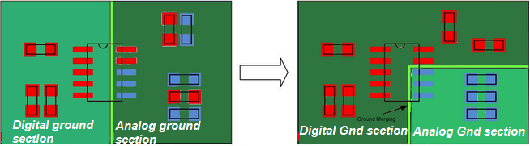
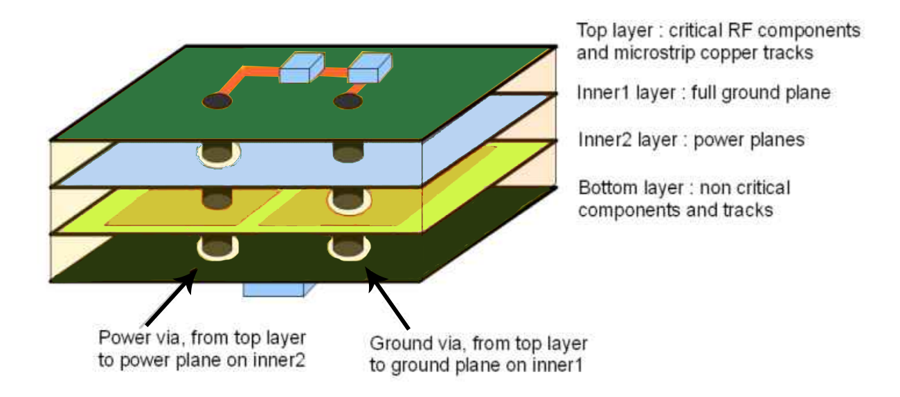
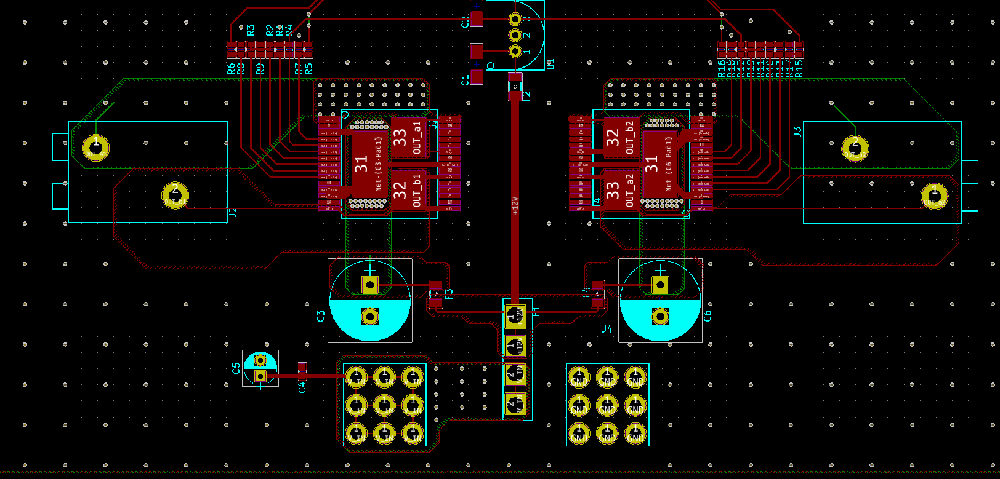

Some of these tips are geared towards [KiCad](http://kicad-pcb.org)

## Layout

- If possible, put all parts on one side of the board
- Use 0.025" or 0.050" grid spacing
- User the square pad on a footprint to mark the polarity, i.e., make all 
square pads either ground or power
- If possible, have data lines run left-to-right on one side of a board and have 
them run top-to-bottom on the other. This helps to reduce cross talk. Put another 
way, have your signal lines running in different directions on different layers 
of the board
- Distance between traces: 0.010" - 0.007"
- Avoid traces that turn 90 degrees, always curve them
- For debugging, make signal pads easily accessible to debugging
- Keep power and control grounds separate
- Keep digital and analog grounds separate
    - Probably want to have a filter on the analog ground, especially 
    if you cannot keep them separate
- When you test continuity, be **aware** that a good connection should have 
< 1 ohm of resistance. However, it will still beep with > 1 ohm of resistance 
which really indicates a cold solder joint. This joint *will* fail at some point
- Choosing components the same size as the trace will reduce impedance matching issues
- Separate analog and digital ground planes

## Multilayer PCB

- Place high frequency traces over a solid ground plane
- Use vias connect components with power and ground in the shortest 
path possible
- Layout of the layers:
    - **Layer 1:** High frequency components
    - **Layer 2:** Ground plane
    - **Layer 3:** Power plane made as large as possilbe to reduce impediance
    - **Layer 4:** Other lower frequency parts

## Power

- Avoid daisy chaining part's power together; instead, make power 
rails and branch each part off of the main
- Watchout for vias breaking up power/ground plane and causing:
    - Power forced through narrow routes, making hot spots on the PCB
        - Simlar to running high current through small traces
    - Return path must travel farther around lots of vias and creating large ground loop
        - Analogy: rivers create choke points where lots of traffic must cross via a bridge
- Make power traces larger to handle in-rush currents
- Always use a ground pour or ground plane
- Long power lines act as antennas and pick up RF noise. Use capacitors to 
filter the noise out and place as close to the IC power pin as possible
    - Slow frequency noise: 1-10 uF
    - Medium noise: 0.1-1 uF
    - High Frequency noise: 0.001-0.1uF
    
### High Power

- copper weights of 1oz or 2oz carrying currents in the mA to tens of amps range are typically sufficient
- When doing high power PCBs, plan to handle shorts with things like fuzes
- For high current applications, like feeding motors/actuators, put capacitors as close to the motor/actuator as possible and use 10uF-100uF as buffers
- Traces widths (use the calculator in KiCad):

    | Width [in] | Width [mm]| Amps |
    |------------|-----------|------|
    |0.010       | 0.254     | 0.3A |
    |0.015       | 0.381     | 0.4A |
    |0.020       | 0.508     | 0.7A |
    |0.025       | 0.635     | 1.0A |
    |0.050       | 1.27      | 2.0A |
    |0.100       | 2.54      | 4.0A |
    |0.150       | 3.81      | 6.0A |

- User copper pours to move lots of current for power and ground:

# References
- [11 Best High-Speed PCB Routing Practices](https://www.protoexpress.com/blog/best-high-speed-pcb-routing-practices/)
- [The Best High Current PCB Design Tips](https://www.tempoautomation.com/blog/the-best-high-current-pcb-design-tips/)
- [High Power PCB Design Tips & Tricks](https://www.microtype.io/high-power-pcb-design-tips-tricks/)
- TI Application Note: [Best Practices for Board Layout of Motor Drivers](slva959a.pdf)
