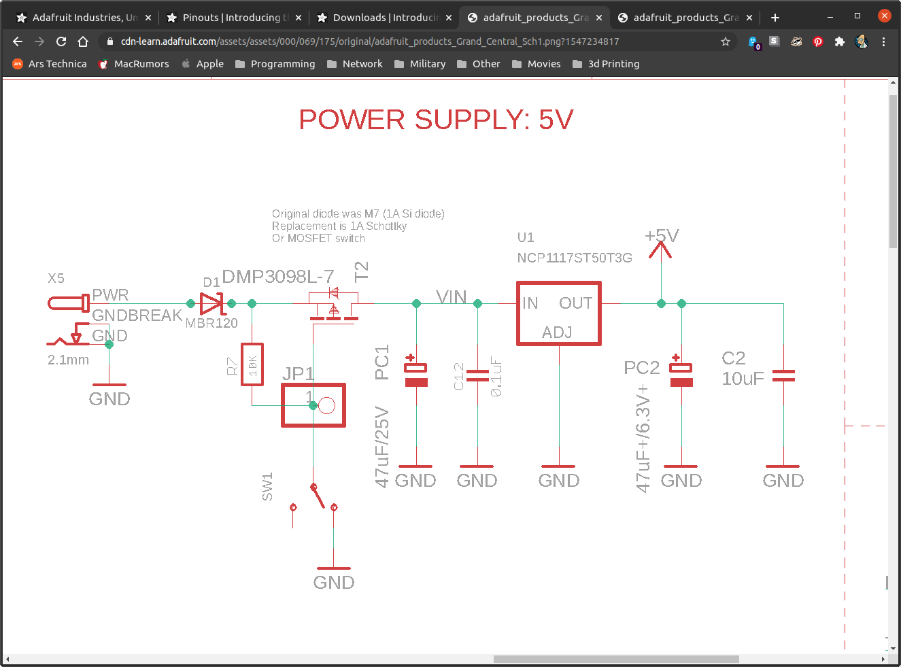
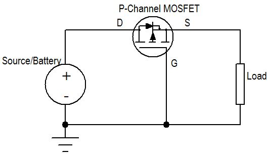
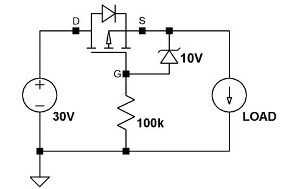

## Preventing Reverse Polarity

The easiest way to prevent a battery from getting hooked up backwards in your
robot is to key your power connectors to they can only be installed one way.
However, if people are making their own, sometimes this isn't good enough. A better
way is to design your circuit so it prevents this.

## Diodes

Diodes are simple and effective, but drop the input voltage. If you already have
more input voltage than you need, say 12V in for a 5V system, then losing 1.5V
isn't a big deal. To reduce the impact of diodes, generally schottky diodes
are used since they have a lower forward voltage drop than general pn-junction
diodes.

## MOSFET

Using a diode is one easy way to prevent current in your system from flowing in
the wrong direction. However, they have a forward voltage drop which both reduces
the amount of available battery voltage and wastes power.

| Part | Voltage Drop at 2A | Power at 2A |
|---|---|---|
| Diode (1N5400) | 0.85V                                      | 1.7W   |
| Schottky Diode | 0.55V                                      | 1.1W   |
| PNP MOSFET     | R_DS(ON)=26 mOhm to 2A * .026 ohm = 52 mV  | 1.04mW |

Using a PNP MOSFET is better because it lowers your battery voltage less and
wastes less power.

Sometimes you have to do more:

This [video](https://www.youtube.com/watch?v=IrB-FPcv1Dc) does a great job of explaining
this a little more. It also explains why you *might* have to include a resistor and zener
diode to clamp the voltage, depending on the MOSFET you select.

### Sizing MOSFET

If the values for Diodes Inc DMP2045U P-Channel MOSFET are:

- Max temp = 125C
- Ambient temp = 25C
- $R_{DS(ON)}$ = 90 m$\omega$

$$
\Delta T = T_{max} - T_{min} = P_D R_{\theta J A} \\
P_D = R_{DS(ON)} I^2_{rms} \\
I = 4.48A
$$

# References

- [electronics-stackexchange](https://electronics.stackexchange.com/a/104545)
- [TI reverse power protection](mosfet-reverse-polarity.pdf)
- [Adafruit schematic](https://cdn-learn.adafruit.com/assets/assets/000/069/175/original/adafruit_products_Grand_Central_Sch1.png?1547234817)
