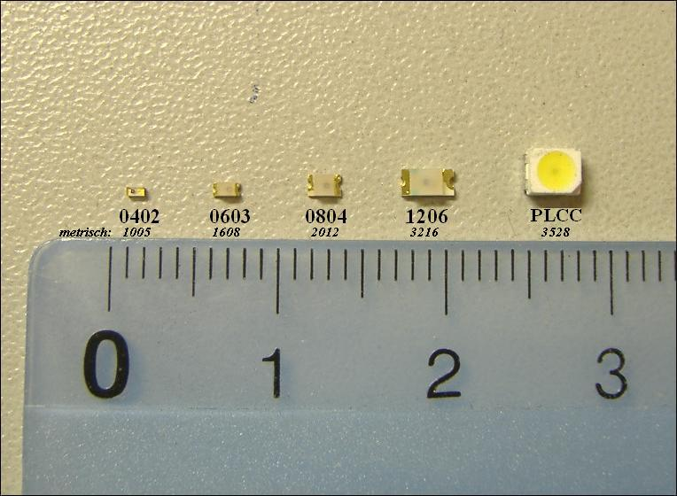
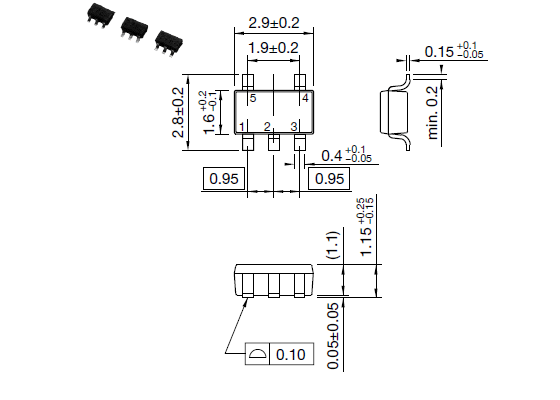
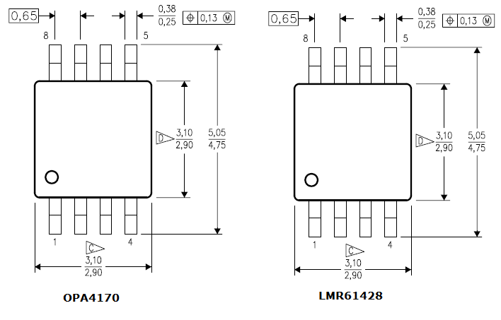
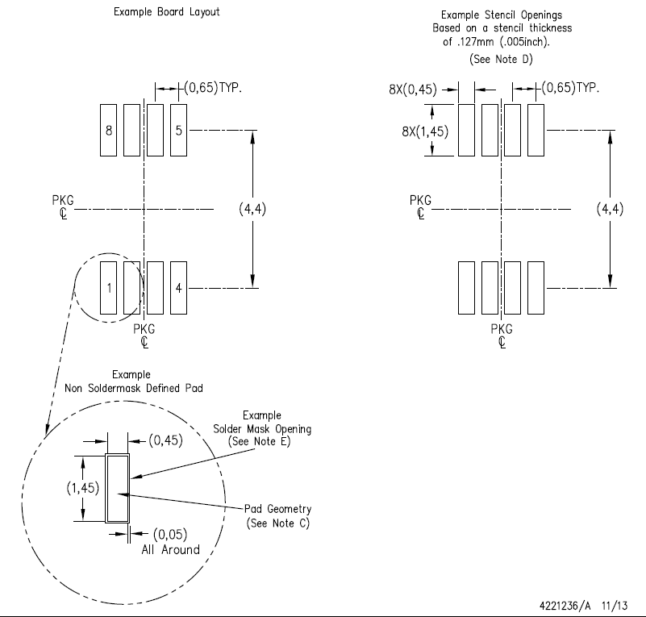

## Resistors and Diodes

The numbers represent their physical sizes in inches, for example,
a 1206 is 0.125 x 0.060 inch.

| Num  | Size (mm)   | Difficulty                                                           |
|------|-------------|----------------------------------------------------------------------|
| 1206 | 3.20 x 1.60 | easy                                                                 |
| 0805 | 2.00 x 1.25 | moderate                                                             |
| 0603 | 1.60 x 0.80 | harder, but doable (need good lighting, tweezers, and magnification) |
| 0402 | 1.00 x 0.50 | never tried, don't have any, I can barely see a 0603 :smile:)        |

## Packages

The smallest I can do is a SOT-25 or SOT-23 (SOT-223 is x4 larger). The
VSSOP-8 shown below is smaller with the pin spacing ~1/2 the distance
appart ... too small for me.

### SOT-25

### VSSOP-8

### Other

# Wikipedia Info

- [SOT and TSOT dimensions](https://en.wikipedia.org/wiki/Small-outline_transistor)
