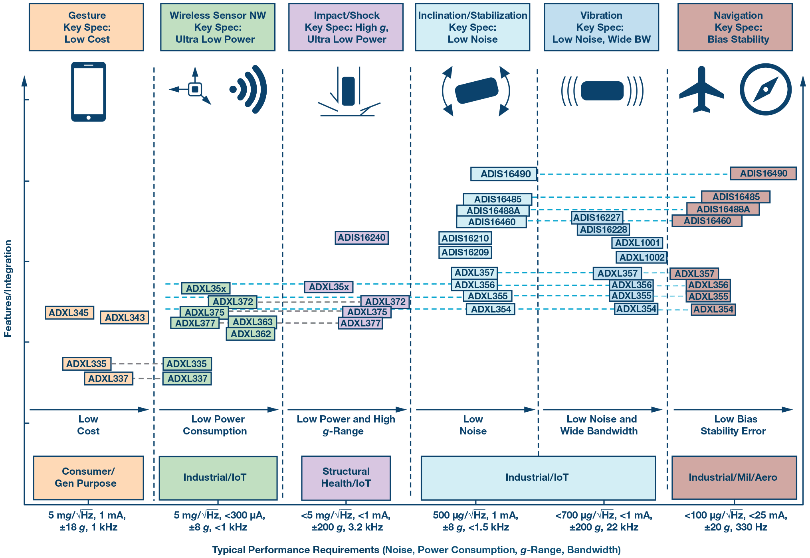

## Gyro

- white noise (short term) is the $\pm 5\sigma$ that can be filtered using an averaging filter
- random walk (long term) due to integrating noise

## Accelerometer

- noise level: precision = variance, accel $\pm$ 10mg
- noise density: is the square root of the power spectral denisty of the noise output in $ug / \sqrt{Hz}$ units
    - equation: $noise = NoiseDenisty \sqrt{BandWidth * 1.6}$
        - where $BandWidth$ is the accelerometer bandwdith, set by capacitors on the accelerometer outputs
    - since noise is gauassian an duncorrelated, it can be reduced by averaging the outputs from several accelerometers
- accelerometer bandwidth:
    - digital: per nyquist sampling criterion, bandwidth is half the Output Data Rate (ODR)
    - analog: the signal frequency at which the response falls to -3dB of the response to DC (or low-frequency) acceleration
- total noise: $TotalNoise = NoiseDensity * \sqrt{NoiseBandwdith}$
- accurate tilt (inclination) sensing is challenging for MEMS capacitive accelerometers in th epresense of vibration
    - <1$^\circ$ is challenging, with greater more achievable
### Performance

# References

- [Analog.com: Choosing the most suitable mems accelerometer for you application](https://www.analog.com/en/analog-dialogue/articles/choosing-the-most-suitable-mems-accelerometer-for-your-application-part-1.html)
- [Analog.com: accelerometer specification definitions](https://www.analog.com/en/products/landing-pages/001/accelerometer-specifications-definitions.html#)
