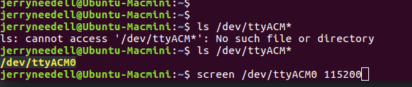

# Using the Serial Port from the Command Line

## `screen`

You can use a simple command `screen [port] [speed]` to talk with things connected
to a serial port.

You might have to install it: `sudo apt-get install screen`

Once you start screen, it will run (even in the backgound) until you kill it:

- `screen [port] [baud]`: start a session
- `screen -r`: if you disconnected from a screen session, this will allow you
  to reattach
- `ctrl-a d`: detach to get back to the terminal and do other things. Note that
  `screen` **is still running in the background** and you must *reconnect* to
  access the serial port again
- `ctrl-a k`: this outright kills a `screen` session and disconnect `screen` from
  the serial port
- `ctrl-a ?`: print `screen` help

# References

- [rackaid screen tutorial](https://www.rackaid.com/blog/linux-screen-tutorial-and-how-to/)
- [youtube video on screen](https://www.youtube.com/watch?time_continue=4&v=hB6Y72DK8mc)
