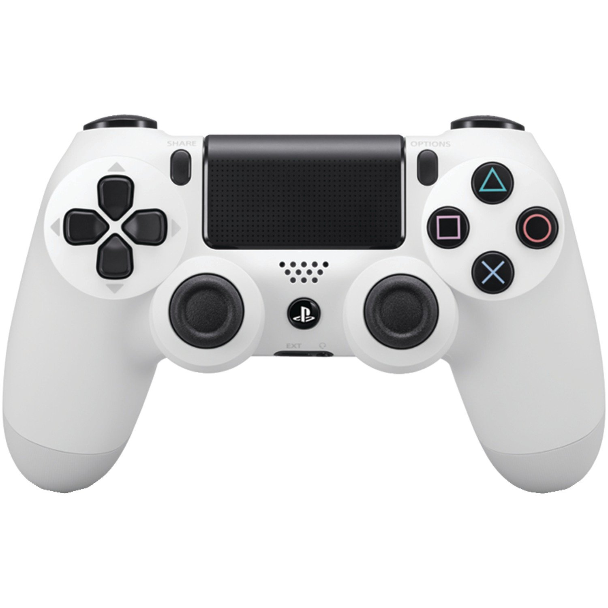

PS4 Controller
================

:date: 2016-05-05
:modified: 2016-07-28
:summary: How to hook up your PS4 controller to Raspbian.

Setup Bluetooth
----------------------

Reference `here <http://pes.mundayweb.com/html/Using%20PS4%20Control%20Pads%20via%20Bluetooth.html>`_

Requirements

1. A compatible Bluetooth 2.1+ USB adapter
2. At least one official Sony PlayStation 4 control pad

Setup
-------

Log into your Raspberry Pi either via SSH or using a keyboard at the console.

::

	sudo systemctl enable bluetooth.service
	sudo systemctl start bluetooth.service

Pairing using ``bluetoothctl``::

	sudo bluetoothctl

Some of the commands available::

	[bluetooth]# help
	Available commands:
	  list                       List available controllers
	  show [ctrl]                Controller information
	  select <ctrl>              Select default controller
	  devices                    List available devices
	  paired-devices             List paired devices
	  power <on/off>             Set controller power
	  pairable <on/off>          Set controller pairable mode
	  discoverable <on/off>      Set controller discoverable mode
	  agent <on/off/capability>  Enable/disable agent with given capability
	  default-agent              Set agent as the default one
	  scan <on/off>              Scan for devices
	  info <dev>                 Device information
	  pair <dev>                 Pair with device
	  trust <dev>                Trust device
	  untrust <dev>              Untrust device
	  block <dev>                Block device
	  unblock <dev>              Unblock device
	  remove <dev>               Remove device
	  connect <dev>              Connect device
	  disconnect <dev>           Disconnect device
	  version                    Display version
	  quit                       Quit program

At the ``bluetoothctl`` prompt type the following commands::

	agent on
	default-agent
	power on
	discoverable on
	pairable on
	scan on

**Note** I had to hit ``ctrl-c`` to get it to work after running ``bluetoothctl``
for some reason.

Example output can be found below::

	[pi@pes ~]$ bluetoothctl
	[NEW] Controller 00:15:XX:XX:XX:XX pes [default]
	[bluetooth]# agent on
	Agent registered
	[bluetooth]# default-agent
	Default agent request successful
	[bluetooth]# power on
	Changing power on succeeded
	[bluetooth]# discoverable on
	Changing discoverable on succeeded
	[CHG] Controller 00:15:XX:XX:XX:XX Discoverable: yes
	[bluetooth]# pairable on
	Changing pairable on succeeded
	[bluetooth]# scan on
	Discovery started

Now put your Sony PlayStation 4 control pad into pairable mode by holding down
the Share and PlayStation buttons until the light bar on the control pad flashes
yellow. After a few seconds you should see at the ``bluetoothctl`` prompt that
your control pad has been discovered, e.g.::

	[bluetooth]# scan on
	Discovery started
	[CHG] Controller 00:15:XX:XX:XX:XX Discovering: yes
	[NEW] Device 00:3C:XX:XX:XX:XX 00-3C-XX-XX-XX-XX
	[NEW] Device 1C:66:XX:XX:XX:XX 1C-66-XX-XX-XX-XX
	[CHG] Device 1C:66:XX:XX:XX:XX LegacyPairing: no
	[CHG] Device 1C:66:XX:XX:XX:XX Name: Wireless Controller
	[CHG] Device 1C:66:XX:XX:XX:XX Alias: Wireless Controller
	[CHG] Device 1C:66:XX:XX:XX:XX LegacyPairing: yes
	[CHG] Device 1C:66:XX:XX:XX:XX Class: 0x002508
	[CHG] Device 1C:66:XX:XX:XX:XX Icon: input-gaming

Take a note of the Bluetooth MAC address shown for “Wireless Controller”, e.g.
1C:66:XX:XX:XX:XX in my case.

Now type::

	pair MAC

where MAC is the MAC address of your control pad and when prompted enter 0000
as the PIN, for example::

	[bluetooth]# pair 1C:66:XX:XX:XX:XX
	Attempting to pair with 1C:66:XX:XX:XX:XX
	[CHG] Device 1C:66:XX:XX:XX:XX Connected: yes
	Request PIN code
	[agent] Enter PIN code: 0000
	[CHG] Device 1C:66:XX:XX:XX:XX Modalias: usb:v054Cp05C4d0100
	[CHG] Device 1C:66:XX:XX:XX:XX UUIDs: 00001124-0000-1000-8000-00805f9b34fb
	[CHG] Device 1C:66:XX:XX:XX:XX UUIDs: 00001200-0000-1000-8000-00805f9b34fb
	[CHG] Device 1C:66:XX:XX:XX:XX Paired: yes
	Pairing successful
	[CHG] Device 1C:66:XX:XX:XX:XX Connected: no

Next we must trust the control pad by running::

	trust MAC

where MAC is the MAC address of your control pad, for example::

	[bluetooth]# trust 1C:66:XX:XX:XX:XX
	[CHG] Device 1C:66:XX:XX:XX:XX Trusted: yes
	Changing 1C:66:XX:XX:XX:XX trust succeeded

Finally, run the following command to connect to the control pad::

	[bluetooth]# connect 1C:66:XX:XX:XX:XX
	Attempting to connect to 1C:66:XX:XX:XX:XX
	[CHG] Device 1C:66:XX:XX:XX:XX Connected: yes
	Connection successful

Then type ``quit`` to exit back to the command prompt. You should now see that
the light bar on your control pad is blue.

Other useful info::

	[bluetooth]# info 1C:66:xx:xx:xx:xx
	Device 1C:66:xx:xx:xx:xx
		Name: Wireless Controller
		Alias: Wireless Controller
		Class: 0x002508
		Icon: input-gaming
		Paired: yes
		Trusted: yes
		Blocked: no
		Connected: yes
		LegacyPairing: no
		UUID: Human Interface Device... (00001124-0000-1000-8000-00805f9b34fb)
		UUID: PnP Information           (00001200-0000-1000-8000-00805f9b34fb)
		Modalias: usb:v054Cp05C4d0100

::

	[bluetooth]# paired-devices
	Device 1C:66:xx:xx:xx:xx Wireless Controller

::

	[bluetooth]# connect 1C:66:xx:xx:xx:xx
	Attempting to connect to 1C:66:xx:xx:xx:xx
	Connection successful

::

	[bluetooth]# disconnect 1C:66:6D:76:9B:B4
	Attempting to disconnect from 1C:66:xx:xx:xx:xx
	Successful disconnected
	[CHG] Device 1C:66:xx:xx:xx:xx Connected: no

Reconnect after reboot
------------------------

1. put PS4 controller into pairable mode (press PS button and Share), the front light bar will flash.
2. run ``bluetoothctl``
	1. connect 1C:66:6D:76:9B:B4

Debug
------

::

	cat /dev/input/js0

You should see some strange characters appear as you use the joystick.

::

	sudo apt-get install joystick
	jstest /dev/input/js0

Finally Got Working
---------------------

There are issues with `serial port on rpi 3 <http://raspberrypi.stackexchange.com/questions/45570/how-do-i-make-serial-work-on-the-raspberry-pi3>`_

::

	pi@zoidberg ~ $ more /boot/cmdline.txt
	dwc_otg.lpm_enable=0 console=tty1 root=/dev/mmcblk0p2 rootfstype=ext4
	elevator=deadline fsck.repair=yes rootwait

::

	sudo apt-get install joystick

The info below will allow you to connect a PS4 and get you ``/dev/input/js0`` however,
only the touch pad worked when I did ``jstest /dev/input/js0``
(or you could do ``cat /dev/input/js0`` but only strange characters appear, but it
works too).

So do ``pip install ds4drv`` (you need version 0.5.1 to work on jessie/rpi3) and
it will go through and pair your device. Also follow the instructions on
`ds4drv <https://github.com/chrippa/ds4drv>`_ to setup udev right. Then run:

::

	ds4drv

This will pair and setup your joystick to work (I use SDL2 as my joystick interface)
and it work great.

Also note, the light bar in the front should be strong, bright blue when paired.
Using the instructions below, and only getting it to partially work, my light
bar was blue, but dimm.

References
-------------

* `PS4 wiki <http://www.psdevwiki.com/ps4/DualShock_4>`_
* http://eleccelerator.com/wiki/index.php?title=DualShock_4
* `ds4drv <https://github.com/chrippa/ds4drv>`_
