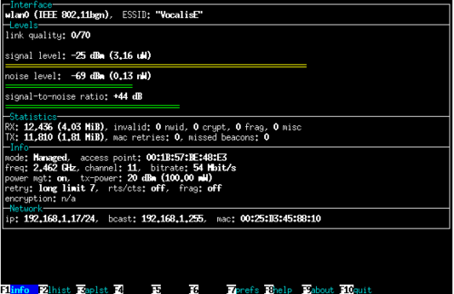

Networking 2 - wifi
========================

:date: 2017-10-09
:summary: WiFi Networking

Adaptor Info
-------------

.. code-block:: bash

	$ iw dev
	phy#1
		Interface wlan1
			ifindex 4
			wdev 0x100000001
			addr 28:c6:8e:56:a3:3f
			type managed
	phy#0
		Interface wlan0
			ifindex 3
			wdev 0x1
			addr b8:27:eb:94:14:9a
			ssid knowhere
			type managed
			channel 11 (2462 MHz), width: 20 MHz, center1: 2462 MHz

Determine Connection Info
------------------------------

.. code-block:: bash

	$ iw wlan0 link
	Connected to f0:99:bf:0e:86:98 (on wlan0)
		SSID: knowhere
		freq: 2462
		RX: 4746300 bytes (25943 packets)
		TX: 212945 bytes (1263 packets)
		signal: -65 dBm
		tx bitrate: 65.0 MBit/s

		bss flags:	short-slot-time
		dtim period:	3
		beacon int:	100

Scan for Access Points
------------------------

.. code-block:: bash

	$ sudo iw wlan0 scan
	BSS f0:99:bf:0e:86:98(on wlan0) -- associated
		TSF: 0 usec (0d, 00:00:00)
		freq: 2462
		beacon interval: 100 TUs
		capability: ESS Privacy SpectrumMgmt ShortSlotTime RadioMeasure (0x1511)
		signal: -63.00 dBm
		last seen: 0 ms ago
		SSID: knowhere
		Supported rates: 1.0* 2.0* 5.5* 11.0* 18.0 24.0 36.0 54.0
		DS Parameter set: channel 11
		TIM: DTIM Count 2 DTIM Period 3 Bitmap Control 0x0 Bitmap[0] 0x0
		Country: US	Environment: Indoor/Outdoor
			Channels [1 - 11] @ 30 dBm
		Power constraint: 0 dB
		TPC report: TX power: 20 dBm
		ERP: <no flags>
		RSN:	 * Version: 1
			 * Group cipher: CCMP
			 * Pairwise ciphers: CCMP
			 * Authentication suites: PSK
			 * Capabilities: 1-PTKSA-RC 1-GTKSA-RC (0x0000)
		Extended supported rates: 6.0 9.0 12.0 48.0
		HT capabilities:
			Capabilities: 0x19ad
				RX LDPC
				HT20
				SM Power Save disabled
				RX HT20 SGI
				TX STBC
				RX STBC 1-stream
				Max AMSDU length: 7935 bytes
				DSSS/CCK HT40
			Maximum RX AMPDU length 65535 bytes (exponent: 0x003)
			Minimum RX AMPDU time spacing: 4 usec (0x05)
			HT RX MCS rate indexes supported: 0-23
			HT TX MCS rate indexes are undefined
		HT operation:
			 * primary channel: 11
			 * secondary channel offset: no secondary
			 * STA channel width: 20 MHz
			 * RIFS: 1
			 * HT protection: no
			 * non-GF present: 1
			 * OBSS non-GF present: 0
			 * dual beacon: 0
			 * dual CTS protection: 0
			 * STBC beacon: 0
			 * L-SIG TXOP Prot: 0
			 * PCO active: 0
			 * PCO phase: 0
		Extended capabilities: 6
		WMM:	 * Parameter version 1
			 * u-APSD
			 * BE: CW 15-1023, AIFSN 3
			 * BK: CW 15-1023, AIFSN 7
			 * VI: CW 7-15, AIFSN 2, TXOP 3008 usec
			 * VO: CW 3-7, AIFSN 2, TXOP 1504 usec

Find SSIDs
------------

.. code-block:: bash

	$ sudo iw wlan0 scan | grep SSID
		SSID: knowhere
		SSID: codybear14-2.4
		SSID: xfinitywifi
		SSID: xfinitywifi
		SSID: HOME-617F
		SSID: LLN_Bus_2
		SSID: Kamino
		SSID: Hoth
		SSID: DIRECT-roku-489-704C09
		SSID: MacStat Wi-Fi
		SSID: KwikStixII
		SSID: CastorFamily
		SSID: xfinitywifi
		SSID: xfinitywifi
		SSID: IDMCHmWkNet
		Extended capabilities: HT Information Exchange Supported, Extended Channel Switching, TFS, WNM-Sleep Mode, TIM Broadcast, BSS Transition, SSID List, 6
		SSID: HP-Print-AA-Photosmart 5520
		SSID: \x00\x00\x00\x00\x00\x00\x00\x00\x00\x00\x00\x00\x00\x00\x00\x00\x00\x00\x00\x00\x00\x00
		SSID: \x00\x00\x00\x00\x00\x00\x00\x00\x00\x00\x00\x00\x00\x00\x00\x00\x00\x00\x00\x00\x00\x00
		SSID: NETGEAR90
		SSID: xfinitywifi

Proc
--------

.. code-block:: bash

	$ cat /proc/net/wireless
	Inter-| sta-|   Quality        |   Discarded packets               | Missed | WE
	 face | tus | link level noise |  nwid  crypt   frag  retry   misc | beacon | 22
	 wlan0: 0000   45.  -65.  -256        0      0      0     12      0        0

You can also automatically update it with:

.. code-block:: bash

	watch -n 1 cat /proc/net/wireless

``watch`` will update every second.

``iwgetid``
-------------

``iwgetid`` command report ESSID, NWID or AP/Cell Address of wireless network.
``iwgetid`` is easier to integrate in various scripts.

Wavemon
----------

Install ``wavemon`` with: ``sudo apt install wavemon``

