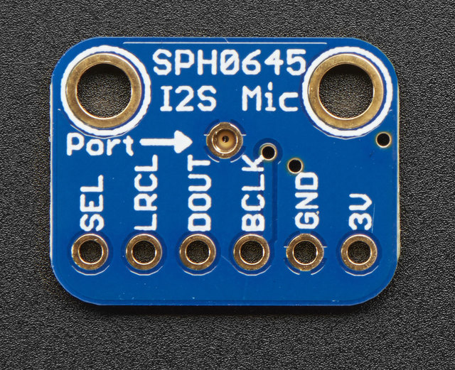
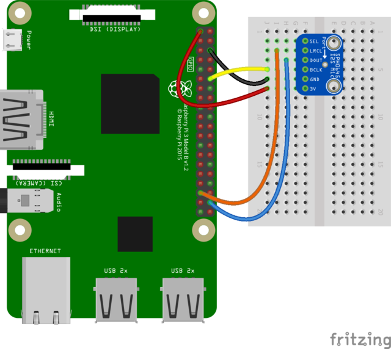
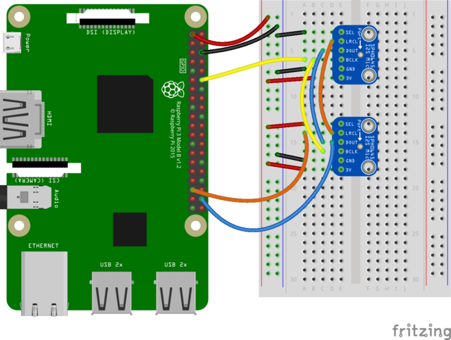

[Sample capture](static/file.wav)

## Wiring

- **BCLK**: the bit clock, also known as the data clock or just 'clock' - comes from the I2S master to tell the microphone its time to transmit data. This should run at 2-4 MHz but we've found you can often run it a little slower and it'll work fine
- **DOUT**: the data output from the mic!
- **LRCLK**: the left/right clock, also known as WS (word select), this tells the mic when to start transmitting. When the LRCLK is low, the left channel will transmit. When LRCLK is high, the right channel will transmit.
- **SEL**: the channel select pin. By default this pin is low, so that it will transmit on the left channel mono. If you connect this to high logic voltage, the microphone will instantly start transmitting on the right channel.



Setting on mic `SEL` pin HIGH and the other LOW will put them on different channels, either right or left.



## ALSA Setup

```bash
pi@create tmp $ cat ../.asoundrc
#This section makes a reference to your I2S hardware, adjust the card name
# to what is shown in arecord -l after card x: before the name in []
#You may have to adjust channel count also but stick with default first
pcm.dmic_hw {
	type hw
	card sndrpisimplecar
	channels 2
	format S32_LE
}

#This is the software volume control, it links to the hardware above and after
# saving the .asoundrc file you can type alsamixer, press F6 to select
# your I2S mic then F4 to set the recording volume and arrow up and down
# to adjust the volume
# After adjusting the volume - go for 50 percent at first, you can do
# something like
# arecord -D dmic_sv -c2 -r 48000 -f S32_LE -t wav -V mono -v myfile.wav
pcm.dmic_sv {
	type softvol
	slave.pcm dmic_hw
	control {
		name "Boost Capture Volume"
		card sndrpisimplecar
	}
	min_dB -3.0
	max_dB 30.0
}
```

## Software

**Not fully working**

```python
#!/usr/bin/env python2

import pyaudio
import wave

INDEX = 2
CHUNK = 1024
FORMAT = pyaudio.paInt16
CHANNELS = 2
RATE = 44100
RECORD_SECONDS = 5
WAVE_OUTPUT_FILENAME = "output.wav"

p = pyaudio.PyAudio()

print 'Using:', p.get_device_info_by_host_api_device_index(0, INDEX)['name']

stream = p.open(format=FORMAT,
                channels=CHANNELS,
                rate=RATE,
                input=True,
                input_device_index=INDEX,
                frames_per_buffer=CHUNK)

print("* recording")

frames = []

for i in range(0, int(RATE / CHUNK * RECORD_SECONDS)):
    data = stream.read(CHUNK)
    frames.append(data)

print("* done recording")

stream.stop_stream()
stream.close()
p.terminate()

wf = wave.open(WAVE_OUTPUT_FILENAME, 'wb')
wf.setnchannels(CHANNELS)
wf.setsampwidth(p.get_sample_size(FORMAT))
wf.setframerate(RATE)
wf.writeframes(b''.join(frames))
wf.close()
```

# References

- [Adafruit Tutorial](https://learn.adafruit.com/adafruit-i2s-mems-microphone-breakout?view=all)
