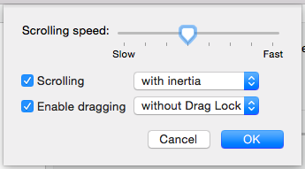

macOS
========

:date: 2015-06-11
:summary: macOS setup

This is my main unix operating system I use daily. Listed here are a few things
to make it more useful.

macOS 10.11 El Captain, issues with Homebrew
--------------------------------------------

To regain access to ``/usr/local``

::

	sudo chown $(whoami):admin /usr/local

You also need commandline tools and/or might need to point to them::

	xcode-select --install
	xcode-select --switch /Applications/Xcode.app

I installed the Beta version of Xcode 7 and for some reason had to switch the links to
the real version.

Show hidden files
------------------

::

	defaults write com.apple.finder AppleShowAllFiles False/True

Software Update
---------------

You can use the command line to update your macOS systems remotely:

::

	softwareupdate --install

-l, --list         List packages available
-i, --install arg  Install packages where arg can be:

  -a, --all          All packages
  -r, --recommended  Just the recommended packages

--schedule arg     Setup scheduling downloads, either on or off

macOS Fixes
--------------

`Enable One-Finger Tap & Drag <http://www.guidingtech.com/34353/re-enable-mavericks-features/>`_

Step 1: On your Mac, first open the Preferences panel. There, head to the Accessibility option as shown below.

Preferences

Preferences Accessibility

.. figure:: {filename}/blog/macOS/pics/Preferences-Accessibility.png
   :align: center

Step 2: On the left panel of the next window, scroll down and select the Mouse & Trackpad option. There, click on the Trackpad Options… button.

Mouse and Trackpad

.. image:: {filename}/blog/macOS/pics/Mouse-and-Trackpad.png
   :align: center

This will bring down an options panel.

Step 3: On this panel, you will notice an interesting option at the bottom named Enable dragging. Check it.

Preferences Enable Dragging

This option not only allows you to enable dragging on your Mac’s trackpad, but also lets you activate or deactivate drag lock (when enabled, this means that when you drag a window, you will have to perform one more click in order to deactivate the drag function).

And done! Now whenever you use your Mac’s trackpad, just double-tap on any ‘draggable’ area of a window to move it around.

Stop Safari re-opening windows
------------------------------

Hold the shift key down and open Safari

::

    defaults write com.apple.Safari ApplePersistenceIgnoreState YES
    defaults write com.apple.Preview ApplePersistenceIgnoreState YES

Stopping App Store Downloads
-----------------------------

Pausing downloads is easy, but if you start one and want to cancel it hold
Option key and click on cancel.

Useful Software
----------------

My hard drive crashed (29 April 2015) and I had to re-install everything. Oh,
a USB drive attached to Airport Extreme as your Time Machine backup doesn't
work! When I tried to reinstall from that, it complained about corrupt Time
Machine files or some such crap. Connect your drive directly to your computer.

So, here is all the software I had to re-install:

- `Github <https://mac.github.com/>`__
- `BitTorrent Sync <http://www.bittorrent.com/>`__
- `Chrome <https://www.google.com/chrome/>`__
- `Atom <https://atom.io/>`__
- `Beamer <http://beamer-app.com/>`__
- `Dropbox <https://www.dropbox.com/>`__
- `Google Drive <https://www.google.com/drive/>`__
