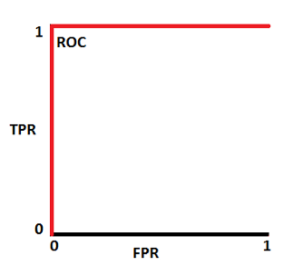
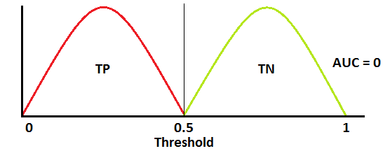
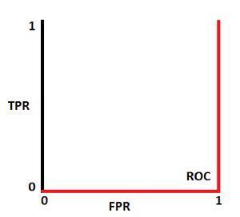

## Terms

$$
TPR = Recall = Sensitivity = \frac{TP}{TP+FN} \\
Specificity = \frac{TN}{TN + FP} \\
FPR = 1 - Specificity = \frac{FP}{TN + FP} \\
Accuracy = \frac{TP + TN}{P + N} \\
Precision = \frac{TP}{TP + FP}
$$

## Relations

  

    
  

  

    
  

  

    
  

  

    
  

  

    
  

  

    
  

  

    
  

  

    
  

## References

- [AUC - ROC Curve](https://towardsdatascience.com/understanding-auc-roc-curve-68b2303cc9c5)
