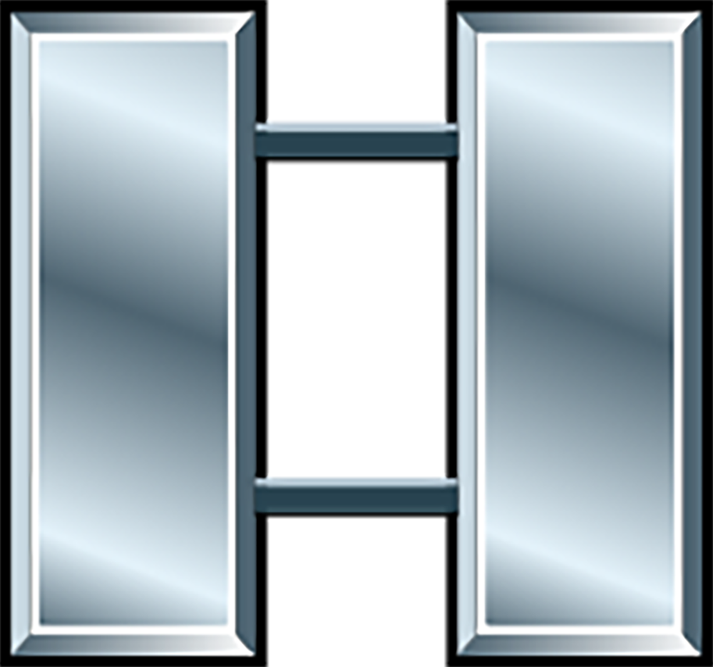
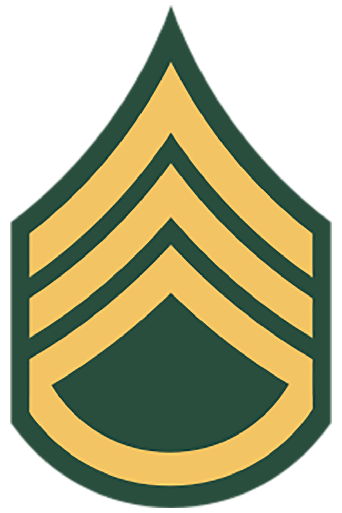

# Military Unit Sizes

| Echelon | Amplifier | Size | Commanded by |
|---------|-----------|---|---|
| Army Group            | XXXXX  | 4-5 Field Armies (400,000) |  |
| Field Army            | XXXX   | 4+ Divisions (90,000) |  |
| Corps                 | XXX    | 2-5 Divisions (45,000) |  |
| Division              | XX     | 3-4 Brigades (15,000) |  |
| Brigade               | X      | 2-3 Battalions (5,000) |  |
| Regement/Group        | \|\|\| | 2-3 Battalions (5,000) |  |
| Battalion/Squadron    | \|\|   | 4-6 Companies (1000) |  |
| Company/Battery/Troop | \|     | 3-4 Platoons (200) |  |
| Platoon               | ...    | 36 |  |
| Section               | ..     | | |
| Squad                 | .      | 10 |  |
| Crew                  | $\emptyset$      | | |

- Theater: The geographical area for which a commander of a geographic combatant command has been assigned responsibility. (JP 1)
- Army group: Used in North Atlantic Treaty Organization or multinational military operations.
- Field army: An echelon of command designated as the Army Service component command responsible for recommendations of allocations and employment of Army forces to the geographic combatant commander. (JP 3-31)
- Corps: An echelon of command and tactical formation that employs divisions, multi-functional brigades, and functional brigades to achieve objectives on land. (ADP 3-90) The corps is the highest level of command that can provide operational direction for actual combat. Higher levels are concerned with administration rather than operations. The current active corps are I Corps at Fort Lewis, Washington; III Corps at Fort Hood, Texas; and XVIII Airborne Corps at Fort Bragg, North Carolina.
- Division: An echelon of command and tactical formation that employs brigade combat teams, multi-functional brigades, and functional brigades to achieve objectives on land. (ADP 3-90)
- Brigade: For historical reasons, armor and Ranger units of brigade size are called regiments, and the equivalent Special Forces units are called groups. In 2016, the Army reorganized its brigades into brigade combat teams, which are autonomous modular brigades that most commonly include one combat arms brigade and its assigned support and fire units.
- Regiment / group: A unit consisting of 2 or more battalions.
- Battalion: A unit consisting of two or more company-, battery-, or troop-size units and a *headquarters*. (ADP 3-90)
- Squadron: A unit consisting of two or more troop-size units and a headquarters in a cavalry organization. (See ATP 3-20.96 for more information on the squadron.)
- Company: A unit consisting of two or more platoons, usually of the same type, with a headquarters and a limited capacity for self-support.
(ADP 3-90)
- Battery: A company-size unit in a field artillery or air defense artillery battalion. (ADP 3-90)
- Troop: A company-size unit in a cavalry organization. (ADP 3-90)
- Platoon: A subdivision of a company or troop consisting of two or more squads or sections. (ADP 3-90)
- Section: A tactical unit of the Army and Marine Corps smaller than a platoon and larger than a squad. (ADP 3-90)

# References

- [DoD Military Units: Army](https://www.defense.gov/Multimedia/Experience/Military-Units/Army/#army)
- [FM 1-02.2 Military Symbols, Nov 2020](military-symbols.pdf)
