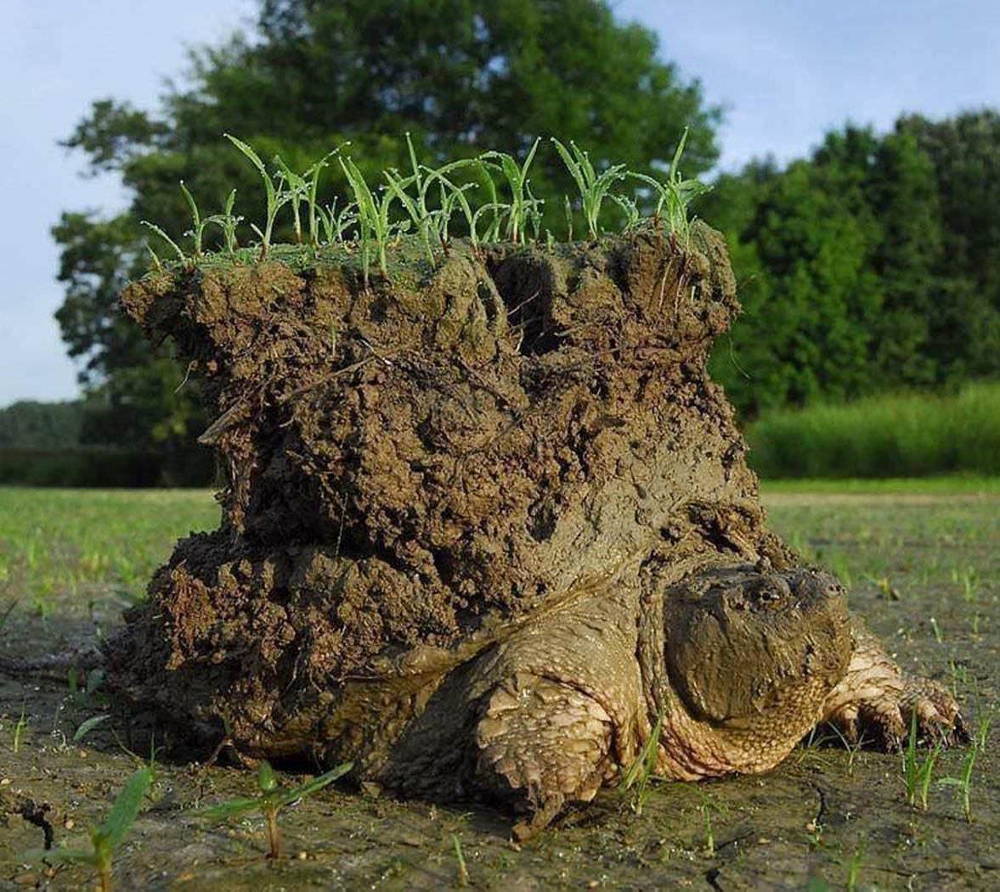

["Turtles all the way down"](https://en.wikipedia.org/wiki/Turtles_all_the_way_down) is an expression of the problem of infinite regress. The saying alludes to the mythological idea of a World Turtle that supports the earth on its back. It suggests that this turtle rests on the back of an even larger turtle, which itself is part of a column of increasingly large turtles that continues indefinitely (i.e. "turtles all the way down").

Stephen Hawking incorporates the saying into the beginning of his 1988 book A Brief History of Time:

A well-known scientist (some say it was Bertrand Russell) once gave a public lecture on astronomy. He described how the earth orbits around the sun and how the sun, in turn, orbits around the center of a vast collection of stars called our galaxy. At the end of the lecture, a little old lady at the back of the room got up and said: "What you have told us is rubbish. The world is really a flat plate supported on the back of a giant tortoise." The scientist gave a superior smile before replying, "What is the tortoise standing on?" "You're very clever, young man, very clever," said the old lady. "But it's turtles all the way down!"
