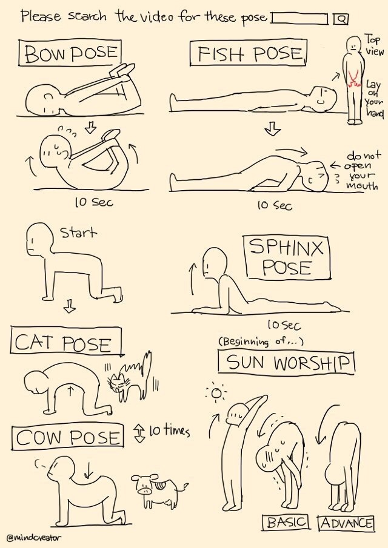
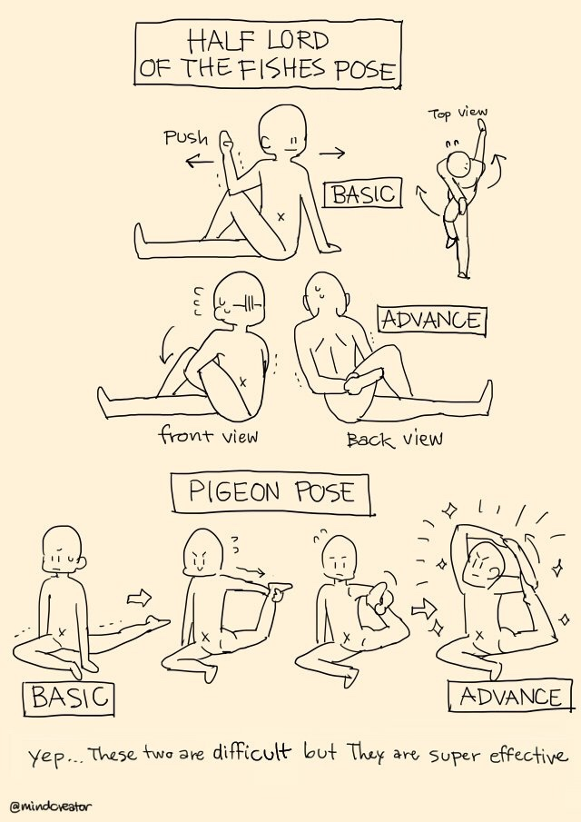
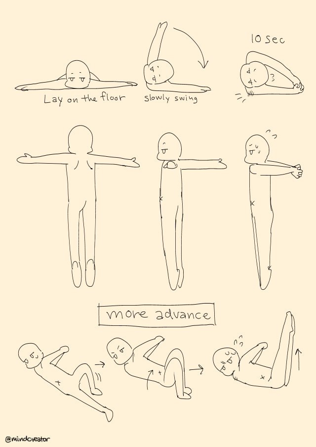

## Stretches

Here are **some** of the stretches I do:

## Lacrosse Ball

[How to Perform a Lacrosse Ball Massage on Sore Muscles](https://www.healthline.com/health/fitness-exercise/lacrosse-ball-massage)
