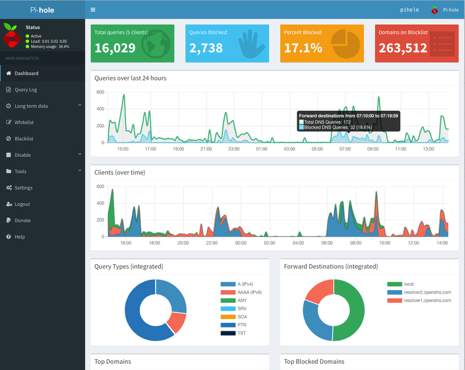

{width=200px}

Website: [Pi-Hole](https://pi-hole.net/)

## Install

```bash
curl -sSL https://install.pi-hole.net | bash
```

## `pihole` Command

```bash
pi@pi-hole ~ $ pihole --help
Usage: pihole [options]
Example: 'pihole -w -h'
Add '-h' after specific commands for more information on usage

Whitelist/Blacklist Options:
  -w, whitelist       Whitelist domain(s)
  -b, blacklist       Blacklist domain(s)
  -wild, wildcard     Blacklist domain(s), and all its subdomains
                        Add '-h' for more info on whitelist/blacklist usage

Debugging Options:
  -d, debug           Start a debugging session
                        Add '-a' to enable automated debugging
  -f, flush           Flush the Pi-hole log
  -r, reconfigure     Reconfigure or Repair Pi-hole subsystems
  -t, tail            View the live output of the Pi-hole log

Options:
  -a, admin           Admin Console options
                        Add '-h' for more info on admin console usage
  -c, chronometer     Calculates stats and displays to an LCD
                        Add '-h' for more info on chronometer usage
  -g, updateGravity   Update the list of ad-serving domains
  -h, --help, help    Show this help dialog
  -l, logging         Specify whether the Pi-hole log should be used
                        Add '-h' for more info on logging usage
  -q, query           Query the adlists for a specified domain
                        Add '-h' for more info on query usage
  -up, updatePihole   Update Pi-hole subsystems
  -v, version         Show installed versions of Pi-hole, Admin Console & FTL
                        Add '-h' for more info on version usage
  uninstall           Uninstall Pi-hole from your system
  status              Display the running status of Pi-hole subsystems
  enable              Enable Pi-hole subsystems
  disable             Disable Pi-hole subsystems
                        Add '-h' for more info on disable usage
  restartdns          Restart Pi-hole subsystems
  checkout            Switch Pi-hole subsystems to a different Github branch
                        Add '-h' for more info on checkout usage
```

## Update

```bash
pihole -up
```

## Service

```bash
sudo service pihole-FTL start | restart | stop
```

## Web Interface



Just point a browser at: http://pi.hole/admin/

From here you play with various settings, add sites to blacklist/whitelist, etc.

# Network Setup

I have my Google Wifi (which is my dhcp server) supply my pi-hole with a static
address and set it as the default DNS for everything on the network.

# Crap!

You can repair things if they go wonky with: `pihole -r`

When I played around with Pi 3, Pi Zero W, and finally Pi Zero, if I moved the
SD card between these pi's everything *but* pi-hole worked. There seems to be
something HW specific ... so I had to do `pihole -r` to repair it. It could have
been something else I did, but I am not sure, I was testing a bunch of stuff
to see performance.

If everything is really bad, you can uninstall with: `pihole uninstall`

# Warning

So I originally installed this on a RPi 3 and then moved the SD card to a Pi Zero.
The web interface uses Nodejs which is built for ARM7, but the zero is ARM6 so you
have to install a suitable node version. I had trouble fixing it, so I uninstalled
and reinstalled it.
