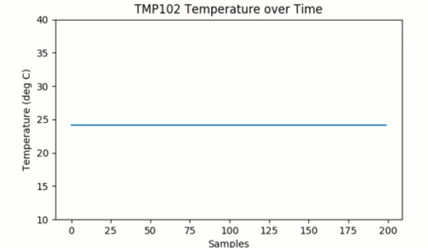

# Matplotlib

Sparkfun has a nice tutorial to plot data in real-time with `matplotlib`:



```python
import matplotlib.pyplot as plt
import matplotlib.animation as animation
import tmp102

# Parameters
x_len = 200         # Number of points to display
y_range = [10, 40]  # Range of possible Y values to display

# Create figure for plotting
fig = plt.figure()
ax = fig.add_subplot(1, 1, 1)
xs = list(range(0, 200))
ys = [0] * x_len
ax.set_ylim(y_range)

# Initialize communication with TMP102
tmp102.init()

# Create a blank line. We will update the line in animate
line, = ax.plot(xs, ys)

# Add labels
plt.title('TMP102 Temperature over Time')
plt.xlabel('Samples')
plt.ylabel('Temperature (deg C)')

# This function is called periodically from FuncAnimation
def animate(i, ys):

    # Read temperature (Celsius) from TMP102
    temp_c = round(tmp102.read_temp(), 2)

    # Add y to list
    ys.append(temp_c)

    # Limit y list to set number of items
    ys = ys[-x_len:]

    # Update line with new Y values
    line.set_ydata(ys)

    return line,

# Set up plot to call animate() function periodically
ani = animation.FuncAnimation(fig,
    animate,
    fargs=(ys,),
    interval=50,
    blit=True)
plt.show()
```


## References

- [Sparkfun](https://learn.sparkfun.com/tutorials/graph-sensor-data-with-python-and-matplotlib/all)
