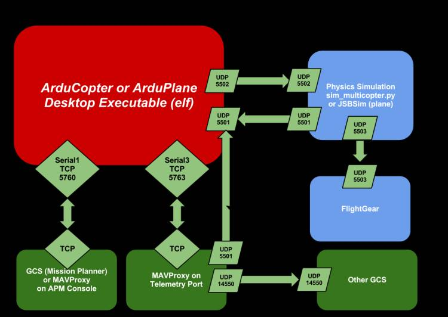

[dronekit-python abandoned](https://github.com/dronekit/dronekit-python/issues/1057)

ArduPilot can be built for  a lot of different platforms and generally rivals what
comercial companies can make. 

Really, we are going to use a bunch of different programs in concert to do this:



## Python

- Setup: `pip install -U pymavlink pyserial dronekit MAVProxy`

## ArduPilot
- [Setup Linux instructions](https://ardupilot.org/dev/docs/building-setup-linux.html#building-setup-linux)
- Get code: `git clone https://github.com/ArduPilot/ardupilot.git`
    - `cd ardupilot`
    - `git submodule update --init --recursive`
    - `./waf configure --board sitl`
- `waf` is the primary tool for compiling the code
- ArduCopter is for quadcopters
- SITL or software in the loop is what I am starting off with
- **flight mode:** different ways to control the drone ... [ref](https://ardupilot.org/copter/docs/flight-modes.html)
    - `GUIDED`: are step-by-step mode, where things can change based on sensor inputs. The python script is responsible for monitoring the copter and allows custom functionality that isn't available out of the box from ArduPilot
    - `AUTO`: enter an entire mission like "surveying a field" where everything is preplaned from start to finish
- `sim_vehicle.py` in `ardupilot/Tools/autotest` will build then launch our SITL quadcopter
    - This tool calls `waf` when you request things that haven't been compiled yet
    - `sim_vehicle.py --map --console -v ArduCopter`
        - If the code hasn't been compiled yet, it will be now
        - map: tracks vehicle on map
            - To see satellite imagery: view -> MicrosoftHybrid 
        - console: telemetry battery, ARM, GPS, etc
        - `mode GUIDED`
        - `arm throttle`
        - `takeoff 10` 
            - launch to 10m altitude, can click on map with mouse to send it places
        - `mofr LAND`
            - Will immediately land and disarm the throttle
- Parameters that change how ArduPilot behaves and can also simulation different things in SITL
    - Complete list of parameters [here](https://ardupilot.org/copter/docs/parameters-Copter-stable-V4.0.3.html)
    - MAVProxy commands: `param show <PARAM>` or `param set <PARAM>
        - `param show rtl_alt` -> `RTL_ALT   140.0`
        - `param set sim_gps_disable 1` to simulate GPS failing

## MAVProxy

- MAVProxy is a python command line tool for SITL
- Manual launching: `mavproxy.py --master tcp:127.0.0.1:5700`
- To manually launch these, do:
    - Start SITL vehicle: `./ardupilot -S -I0 --home -35.363261, 149.165230,584,353 --model "+" --speedup 1 --defaults /home/kevin/apm/copter.parm`
    - GCS: `mavproxy.py --master tcp:127.0.0.1:5760`
- MAVProxy commands: type help to see them all
    - `velocity x y z` (m/s)
    - `takeoff z` (m)
    - `arm throttle` gets vheicle ready to take commands and fly
    - `setyaw angle alt ref`
        - ref 0 absolute angle based on compass
        - ref 1 relative angle
        
## Ground control station ([GCS](http://qgroundcontrol.com/))

- QGroundControl is a visual GCS
    - Install: `sudo apt install gstreamer1.0-plugins-bad gstreamer1.0-libav gstreamer1.0-gl -y`
    - Download AppImage [here](https://docs.qgroundcontrol.com/master/en/getting_started/download_and_install.html)
        - Make executable with: `chmod a+x QGroundControl.AppImage`
    - To linkin QGC, change above to: `mavproxy.py --master tcp:127.0.0.1:5760 --out udp:127.0.0.1:14550`
    - Now QGC will connect to SITL
    - You can change the connect path by going to commlinks -> entering the tcp 127.0.0.1 5763
- `sim_vehicle.py` automates the above, you don't need to do it all by hand
    - launches MAVProxy
    - Now QGC will connect automagically because all of the connects are setup

## MAVLink

- MAVLink is a communication protocol
    - [Common messages](https://mavlink.io/en/messages/common.html)
    - Frame is 8 - 263 bytes: [header][payloadLength][packetSequence][systemID][componentID][data][checksum]
    - Header is `0xFE`
    - sequence counts up
    - SystemID: 1-drone, 255-GCS
    - compenetID is typically 0 and not used much

## Dronekit

- [Dronekit](https://github.com/dronekit/dronekit-python)
    - Install: `pip install dronekit`
    - [Examples](https://github.com/dronekit/dronekit-python/tree/master/docs/examples)
    - Attributes allow you to set and get things about the vehicle that is running
        - These are not instant, the *request* needs to get packaged up and sent via MAVLink to the vehicle
    - `command()`
    - Velocity commands need to be sent every second
    
## Guided Mode Example

```python
#!/usr/bin/env python3
# myscript.py

from dronekit import connect, VehicleMode, LocationGlobalRelative, APIException, Command
import dronekit_sitl
import socket
import time, math
from pymavlink import mavutil # standard messages

def connectMyCopter(ip=None):
    if ip is None:
        # automate starting a SITL vehicle
        sitl = dronekit_sitl.start_default()
        ip = sitl.connection_string()
        
    vehicle = connect(ip, wait_ready=True)
    vehicle.parameters["GPS_TYPE"] = 3
    return vehicle

def arm_and_takeoff(targetHeight):
    while vehcile.is_armable != True:
        time.sleep(1)

    vehicle.mode = VehicleMode("GUIDED")
    while vehicle.mode != "GUIDED":
        time.sleep(1)

    vehicle.armed = True
    while vehicle.armed == False
        time.sleep(1)
        
    vehicle.simple_takeoff(targetHeight) # meters
    
    while True:
        if vehicle.location.global_relative_frame.alt >= 0.95*targetHeight:
            break
        time.sleep(1)
    
    print("Altitude reached: {targetHeight}m")
    return None

def get_distance_meters(tloc, cloc):
    dLat = tloc.lat - cloc.lat
    dLon = tloc.lon - cloc.lon
    return math.sqrt(dLat**2 + dLon**2) * 1.113195e5

def goto(targetLocation):
    distanceToTargetrLocation = get_distance_meters(targetLocation, vehicle.location.global_relative_frame)
    vehicle.simple_goto(targetLocation)
    
    while vehicle.mode.name == "GUIDED":
        currentDistance = get_distance_meters(targetLocation, vehicle.location.global_relative_frame)
        if currentDistance < distanceToTargetLocation * 0.01:
            print("waypoint reached")
            time.sleep(2) # ??
            break
        time.sleep(1)
    return None

#===================================
# Main
#===================================

wp1 = LocationGlobalRelative(44.5020,-88.0603,10) # waypoint (lat,lon, alt)

vehicle = connectMyCopter("127.0.0.1:14550")
arm_and_takeoff(10)

# access a bunch of attributes
print("Ardupilot version: {vehicle.version}")
print("Position: {vehicle.global_relative_frame}")
print("Attitude: {vehicle.attitude} deg") # rpy
print("Velocity: {vehicle.velocity} m/s")
print("Mode: {vehicle.mode.name} ")

goto(wp1)

vehicle.mode = VehicleMode("LAND")
while vehicle.mode != "LAND":
    time.sleep(1)
print("LANDING")

while True:
    time.sleep(1)

vehicle.close() # closes connection
```

```python
def send_local_ned_velocity(vx,vy,vz):
    # this is a non-blocking function
    # need to send a velocity command once per second
    # this is NED, so up is negative and down is positive
    msg = vehicle.message_facotyr.set_position_target_local_ned_encode(
        0,
        0,0,
        mavutil.mavlink.MAV_FRAME_BODY_OFFSET_NED,
        0b0000111111000111, # bitmask
        0,0,0,    # position
        vx,vy,vz, # velocity
        0,0,0,    # acceleration
        0,0)
    vehicle.send_mavlink(msg)
    vehicle.flush()

def send_global_ned_velocity(vx,vy,vz):
    # this is a non-blocking function
    # need to send a velocity command once per second
    # this is NED, so up is negative and down is positive
    msg = vehicle.message_facotyr.set_position_target_local_ned_encode(
        0,   # time boot msec (not used)
        0,0, # target system, target component
        mavutil.mavlink.MAV_FRAME_LOCAL_OFFSET_NED, # reference frame
        0b0000111111000111, # bitmask
        0,0,0,    # position
        vx,vy,vz, # velocity
        0,0,0,    # acceleration
        0,0)
    vehicle.send_mavlink(msg)
    vehicle.flush()
```

```python
def dummy_yaw_initializer():
    lat = vehicle.localtion.global_relative_frame.lat
    lon = vehicle.localtion.global_relative_frame.lon
    alt = vehicle.localtion.global_relative_frame.alt
    
    aLocation = LocationGlobalRelative(lat,lon,alt)
    
    msg = vehicle.messare_factory.set_position_target_global_int_encode(
        0,
        0,0,
        mavutil.mavlik.MAV_FRAME_GLOBAL_RELATIVE_ALT_INT,
        0b0000111111111000,
        aLovation.lat*1e7, # X in WGS84 frame in 1e7*meters
        aLocation.lon*1e7, # Y
        aLocation.alt,     # AMSL
        0,0,0, # velocity NED
        0,0,0, # acceleration
        0,0)   # yaw, yaw rate
    vehicle.send_mavlink(msg)
    vehicle.flush()
    
def condition_yaw(degrees, relative):
    # non-blocking
    # MUST send command to current location BEFORE this will work ... send dummy command
    if relative:
        is_relative = 1
    else:
        is_relative = 0
    
    msg = vehicle.message_factory.command_long_encode(
        0,0    # target system, target component
        mavutil.mavlink.MAV_CMD_CONDITION_YAW, # command
        0,     # confirmation
        degrees,
        0,     # yaw speed m/s
        1,     # direction: -1 CCW, 1 CW
        is_relative,
        0,0,0) # not used
    vehicle.send_mavlink(msg)
    vehicle.flush()

dummy_yaw_initializer()
time.sleep(2)
condition_yaw(0,0)
time.sleep(2)
```

## Auto Mode Example

In this mode, there is no interaction ... just set it and go!

```python
cmd1 = Command(...)       # create a new command
cmd2 = Command(...)
cmd3 = Command(...)

sitl = dronekit_sitl.start_default()
ip = sitl.connection_string()
print(f">> Connecting to {ip}")
vehicle = connect(ip, wait_ready=True)

cmds = vehicle.commands   # get command object
cmds.download()
cmds.wait_ready()         # block until done
cmds.clear()              # get rid of any
cmds.add(cmd1)            # add our new command
cmds.add(cmd2)
cmds.add(cmd3)
vehicle.commands.upload() # send to bird

arm_and_takeoff(10)

vehicle.mode = VehicleMode("AUTO")
while vehicle.mode != "AUTO":
    time.sleep(0.2)
    
while vehicle.location.global_relative_frame > 2:
    time.sleep(2)

```

## Uber Launch Script

- Create script to launch everything at once: `launchSITL.sh`

```
#!/bin/bash

dronekit-sitl copter --home=44.5013,-88.0622,0,180&

sleep 5

QGC.AppImage 2>/dev/null&

sleep 5

screen -dm mavproxy.py --master=tcp:127.0.0.1:5760 --out=127.0.0.1:14550 --out=127.0.0.1:5762

myscript.py

# let's kill everything we put in the background
function finish {
    kill -9 $(ps -eF | grep QG | awk -F' ' '{print $2}')> /dev/null 2>&1
    kill -9 $(ps -eF | grep ardu | awk -F' ' '{print $2}')> /dev/null 2>&1
    kill -9 $(ps -eF | grep mav | awk -F' ' '{print $2}')> /dev/null 2>&1
    kill -9 $(ps -eF | grep apm | awk -F' ' '{print $2}')> /dev/null 2>&1
}

trap finish EXIT
```

## Raspberry Pi Changes

To enable real hardware: Pi and Pixhawk

- `raspi-config`, disable login on serial port, but do enable serial port
- `sudo nano /boot/config.txt` set `dtoverlay=disable-bt` to disable bluetooth

## Command Line

```
STABILIZE> help
STABILIZE> accelcal        : do 3D accelerometer calibration
accelcalsimple  : do simple accelerometer calibration
adsb            : adsb control
ahrstrim        : do AHRS trim
alias           : command aliases
alllinks        : send command on all links
alt             : show altitude information
arm             : arm motors
attitude        : attitude
auxopt          : select option for aux switches on CH7 and CH8 (ArduCopter only)
bat             : show battery information
batreset        : reset battery remaining
calpress        : calibrate pressure sensors
camctrlmsg      : camctrlmsg
cammsg          : cammsg
cammsg_old      : cammsg_old
capabilities    : fetch autopilot capabilities
changealt       : change target altitude
click           : set click location
command_int     : execute mavlink command_int
compassmot      : do compass/motor interference calibration
devid           : show device names from parameter IDs
disarm          : disarm motors
engine          : engine
fence           : geo-fence management
flashbootloader : flash bootloader (dangerous)
ftp             : file transfer
gethome         : get HOME_POSITION
ground          : do a ground start
guided          : fly to a clicked location on map
gyrocal         : do gyro calibration
hardfault_autopilot : hardfault autopilot
land            : auto land
layout          : window layout management
led             : control board LED
level           : set level on a multicopter
link            : link control
lockup_autopilot : lockup autopilot
log             : log file handling
long            : execute mavlink long command
magcal          : magcal
magresetofs     : reset offsets for all compasses
magsetfield     : set expected mag field by field
mode            : mode change
module          : module commands
motortest       : motortest commands
oreoled         : control OreoLEDs
output          : output control
parachute       : parachute
param           : parameter handling
playtune        : play tune remotely
position        : position
posvel          : posvel
rally           : rally point control
rc              : RC input control
rcbind          : bind RC receiver
reboot          : reboot autopilot
relay           : relay commands
repeat          : repeat a command at regular intervals
reset           : reopen the connection to the MAVLink master
script          : run a script of MAVProxy commands
servo           : servo commands
set             : mavproxy settings
setorigin       : set global origin
setspeed        : do_change_speed
setup           : go into setup mode
setyaw          : condition_yaw
shell           : run shell command
signing         : signing control
status          : show status
switch          : flight mode switch control
takeoff         : takeoff
terrain         : terrain control
time            : show autopilot time
tuneopt         : Select option for Tune Pot on Channel 6 (quadcopter only)
up              : adjust pitch trim by up to 5 degrees
vehicle         : vehicle control
velocity        : velocity
version         : fetch autopilot version
watch           : watch a MAVLink pattern
wp              : waypoint management
```

## References

- github: [ardupilot](https://github.com/ArduPilot/ardupilot)
- ArduPilot: [docs](https://ardupilot.org/ardupilot/)
- ArduPilot: [Setting up SITL on Linux](https://ardupilot.org/dev/docs/setting-up-sitl-on-linux.html)
