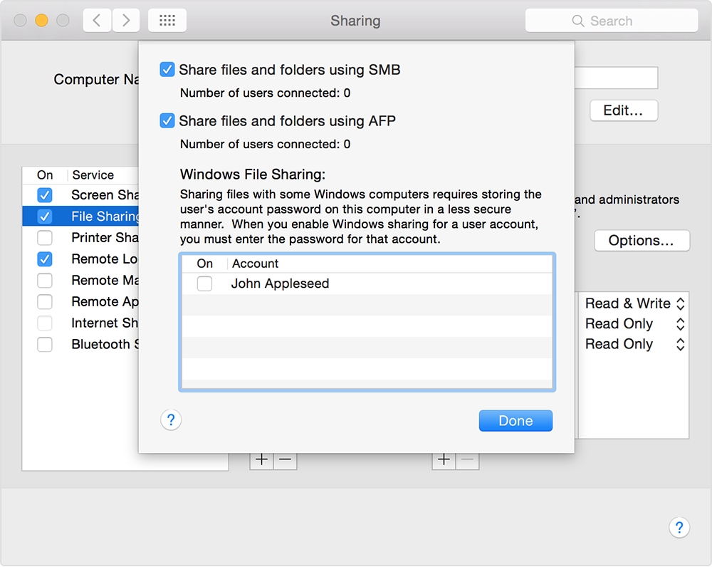

Samba
====================

:date: 2016-06-26
:summary: Setting up Samba so linux plays nice with macOS

Apple is finally beginning to move away from AFP and really embrace SMB with
macOS Sierra. To setup ``samba`` on linux::

	sudo apt-get update
	sudo apt-get install samba samba-common-bin
	sudo cp /etc/samba/smb.conf /etc/samba/smb.bak
	sudo pico /etc/samba/smb.conf

Home Files (pi)
----------------

Now change the following lines to::

	wins support = yes
	...
	[homes]
		browseable = yes
		read only = no

Now execute::

	sudo smbpasswd -a pi
	sudo service smbd restart
	sudo service nmbd restart

You should now have access to your home files when you login as ``pi``. A condensed
version is below:

.. code:: bash

	#======================= Global Settings =======================

	[global]
	   workgroup = WORKGROUP
	   wins support = yes
	   dns proxy = no

	#### Debugging/Accounting ####
	   log file = /var/log/samba/log.%m
	   max log size = 1000
	   syslog = 0
	   panic action = /usr/share/samba/panic-action %d

	####### Authentication #######

	   server role = standalone server
	   passdb backend = tdbsam
	   obey pam restrictions = yes
	   unix password sync = yes
	   passwd program = /usr/bin/passwd %u
	   passwd chat = *Enter\snew\s*\spassword:* %n\n *Retype\snew\s*\spassword:* %n\n *password\supdated\ssuccessfully* .
	   pam password change = yes
	   map to guest = bad user

	############ Misc ############

	# Allow users who've been granted usershare privileges to create
	# public shares, not just authenticated ones
	   usershare allow guests = yes

	#======================= Share Definitions =======================

	[pi]
	   comment = Home Directories
	   browseable = yes
	   read only = no
	   create mask = 0700
	   directory mask = 0700
	   valid users = %S
	   path=/home/%S

	[Mnt]
	   comment = My shared stuff
	   path = /mnt
	   create mask = 0700
	   directory mask = 0700
	   read only = no
	   browseable = yes
	   public = yes
	   force user = pi
	   #force user = root
	   only guest = no

Export a Shared Folder
------------------------

Create a folder or choose an existing one and make sure ``pi`` has control of it
with ``sudo chown -R pi:pi /path/to/share``. In the ``smb.config`` file from
above, add the following at the bottom::

	[Stuff] # name that will show up when browsing  (change it to something meaningful)
	   comment = My shared stuff
	   path = /mnt/usbstorage/Stuff
	   create mask = 0775
	   directory mask = 0775
	   read only = no
	   browseable = yes
	   public = yes
	   force user = pi
	   #force user = root
	   only guest = no

Where ``7=rwx 5=r-x 5=r-x`` is for owner, group, and other. It is probably better
to go with 0700 rather than 0755.

::

	Permission    Action      chmod option
	======================================
	read          (view)      r or 4
	write         (edit)      w or 2
	execute       (execute)   x or 1

	User    ls output
	==================
	owner   -rwx------
	group   ----rwx---
	other   -------rwx

	Symbolic Notation    Octal Notation    English
	============================================================
	----------            0000               no permissions
	---x--x--x            0111               execute
	--w--w--w-            0222               write
	--wx-wx-wx            0333               write & execute
	-r--r--r--            0444               read
	-r-xr-xr-x            0555               read & execute
	-rw-rw-rw-            0666               read & write
	-rwxrwxrwx            0777               read. write & execute

`file permission ref <http://askubuntu.com/questions/638796/what-is-meaning-of-755-permissions-in-samba-share>`_

macOS
-------

Also make sure SMB sharing is turned on (should be):

.. image:: pics/sharing_files.png
	:width: 400px
	:align: center

::

	System Preferences -> Sharing -> File Sharing On

You should see something like (look for the smb entry)::

	Other users can access shared folders on this computer, and administrators
	all volumes, at “afp://xx.xx.xx.xx” or “smb://xx.xx.xx.xx”.

If not, go into ``options`` and turn on SMB. Also I had to check the box next
to my username.

`Infuse <https://firecore.com/infuse>`_
--------------------------------------------

I can also use this app  to play movies on SMB shares. You can get it in the
app store.
