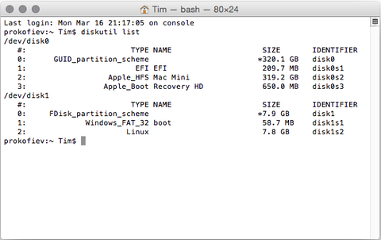
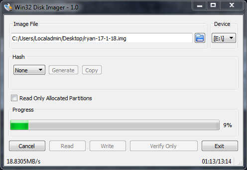

SD Card
=======

:date: 2015-06-10
:summary: Setting up an SD card for RPi

.. figure:: pics/sd.jpg
	:width: 200px
	:align: center

Backup and Restore
--------------------

A good cross platform explanation is `here <https://thepihut.com/blogs/raspberry-pi-tutorials/17789160-backing-up-and-restoring-your-raspberry-pis-sd-card>`_

macOS
------------

Find the disk you want to copy using ``diskutil list``.

Use the ``dd`` command to make a full backup of the image:

::

    sudo dd if=/dev/disk2 of=~/Desktop/backup.dmg

To restore the backup you reverse the commands::

    sudo dd if=/path/to/backup.dmg of=/dev/disk2

Then eject the disk::

	sudo diskutil eject /dev/rdisk2

Windows
--------------

On windows, you can use Win32 Disk Imager from `Sourceforge <https://sourceforge.net/projects/win32diskimager/files/latest/download>`_.

Insert the SD card into your computer, then run the disk imager. Set the SD card location under the Device drop down and set the image file location next to the blue folder icon. Then: 

- **Copy:** Press *Read* to make a copy of the device drive to the image file
- **Write:** Press *Write* to copy the image file to the device drive
