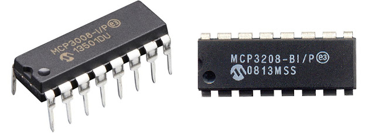

Analog-to-Digital Conversion
===============================

:date: 2016-04-17
:summary: Hooking up an MCP3008 or MCP3208 ADC to an RPi

Even though I have an MCP3208, which is a 12b ADC, I only get 10b of resolution
out of these. Need to figure out why. They both *appeared* to work the same with
no advantage either way.

Kernel Overlay
----------------

Setup of the overlay to load at boot::

	sudo pico /boot/config.txt
	dtparam=spi=on
	dtoverlay=mcp3008:spi0-0-present

Then using the polling C code below::

	root@rpi3:~/mcp3008-poll# ./mcp3008-poll -d0 0

	(use ctrl-c to stop)

	ADC                0
	Read  1036000:   621  ^C

	Summary
	  Elapsed: 56.93 seconds
	    Reads: 1037028
	     Rate: 18215.51 Hz

Python
----------

.. code-block:: python

	import time

	# Import SPI library (for hardware SPI) and MCP3008 library.
	import Adafruit_GPIO.SPI as SPI
	import Adafruit_MCP3008

	# Hardware SPI configuration:
	SPI_PORT   = 0
	SPI_DEVICE = 0
	mcp = Adafruit_MCP3008.MCP3008(spi=SPI.SpiDev(SPI_PORT, SPI_DEVICE))

	print('Reading MCP3008 values, press Ctrl-C to quit...')
	# Print nice channel column headers.
	print('| {0:>4} | {1:>4} | {2:>4} | {3:>4} | {4:>4} | {5:>4} | {6:>4} | {7:>4} |'.format(*range(8)))
	print('-' * 57)
	# Main program loop.
	while True:
	    # Read all the ADC channel values in a list.
	    values = [0]*8
	    for i in range(8):
	        # The read_adc function will get the value of the specified channel (0-7).
	        values[i] = mcp.read_adc(i)
	    # Print the ADC values.
	    print('| {0:>4} | {1:>4} | {2:>4} | {3:>4} | {4:>4} | {5:>4} | {6:>4} | {7:>4} |'.format(*values))
	    # Pause for half a second.
	    time.sleep(0.5)

References
--------------

---

- `Adafruit MCP3008 <https://github.com/adafruit/Adafruit_Python_MCP3008>`_
- `MCP3008 Overlay <http://www.jumpnowtek.com/rpi/Using-mcp3008-ADCs-with-Raspberry-Pis.html>`_
- `C Program to poll overlay <https://github.com/scottellis/mcp3008-poll>`_
