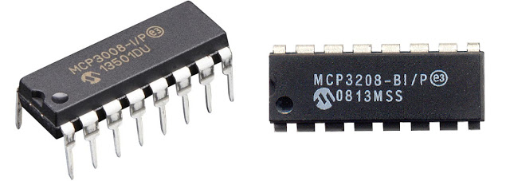

Even though I have an MCP3208, which is a 12b ADC, I only get 10b of
resolution out of these. Need to figure out why. They both *appeared* to
work the same with no advantage either way.

## Kernel Overlay

Setup of the overlay to load at boot:

```
sudo pico /boot/config.txt
dtparam=spi=on
dtoverlay=mcp3008:spi0-0-present
```

Then using the polling C code below:

```
root@rpi3:~/mcp3008-poll# ./mcp3008-poll -d0 0

(use ctrl-c to stop)

ADC                0
Read  1036000:   621  ^C

Summary
  Elapsed: 56.93 seconds
    Reads: 1037028
     Rate: 18215.51 Hz
```

## Python

``` python
import time

# Import SPI library (for hardware SPI) and MCP3008 library.
import Adafruit_GPIO.SPI as SPI
import Adafruit_MCP3008

# Hardware SPI configuration:
SPI_PORT   = 0
SPI_DEVICE = 0
mcp = Adafruit_MCP3008.MCP3008(spi=SPI.SpiDev(SPI_PORT, SPI_DEVICE))


print('Reading MCP3008 values, press Ctrl-C to quit...')
# Print nice channel column headers.
print('| {0:>4} | {1:>4} | {2:>4} | {3:>4} | {4:>4} | {5:>4} | {6:>4} | {7:>4} |'.format(*range(8)))
print('-' * 57)
# Main program loop.
while True:
    # Read all the ADC channel values in a list.
    values = [0]*8
    for i in range(8):
        # The read_adc function will get the value of the specified channel (0-7).
        values[i] = mcp.read_adc(i)
    # Print the ADC values.
    print('| {0:>4} | {1:>4} | {2:>4} | {3:>4} | {4:>4} | {5:>4} | {6:>4} | {7:>4} |'.format(*values))
    # Pause for half a second.
    time.sleep(0.5)
```

# References

- [Adafruit MCP3008](https://github.com/adafruit/Adafruit_Python_MCP3008)
- [MCP3008 Overlay](http://www.jumpnowtek.com/rpi/Using-mcp3008-ADCs-with-Raspberry-Pis.html)
- [C Program to poll overlay](https://github.com/scottellis/mcp3008-poll)
